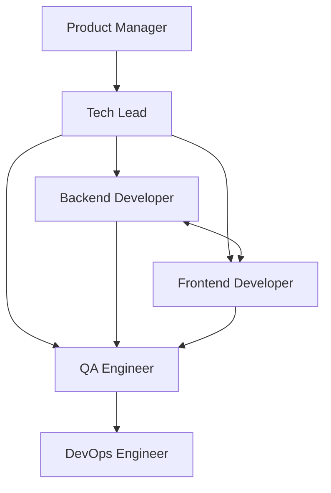

# Development Team Documentation

> **🤖 AI Agents**: Этот документ — входная точка для понимания структуры виртуальной команды разработки. Начните с [TEAM-MASTER-REFERENCE.md](./TEAM-MASTER-REFERENCE.md) для быстрого старта.

## Обзор

Эта документация описывает виртуальную команду разработки для проекта **Admin Logistic Panel v8** — системы управления логистикой. Документация создана для AI-агентов, чтобы они могли "воплощать" роли членов команды.

## Технологический стек проекта

| Компонент | Технология | Документация |
|-----------|------------|--------------|
| Backend | NestJS 11.x | [backend-nestjs.md](../tech-stack/backend-nestjs.md) |
| ORM | Prisma 7.x | [database-prisma.md](../tech-stack/database-prisma.md) |
| Database | PostgreSQL (Supabase) | [database-supabase.md](../tech-stack/database-supabase.md) |
| Frontend | SolidJS 1.9.x | [frontend-solidjs.md](../tech-stack/frontend-solidjs.md) |
| Auth | Supabase Auth | [authentication.md](../tech-stack/authentication.md) |
| Build | Vite 7.x, TypeScript | [typescript-conventions.md](../tech-stack/typescript-conventions.md) |

## Структура команды

### Состав команды

| Роль | Основная зона ответственности |
|------|------------------------------|
| [Product Manager](./personas/pm.md) | Требования, приоритеты, roadmap |
| [Tech Lead](./personas/tech-lead.md) | Архитектура, code review, технические решения |
| [Backend Developer](./personas/backend-developer.md) | NestJS API, Prisma, бизнес-логика |
| [Frontend Developer](./personas/frontend-developer.md) | SolidJS UI, UX, интеграция с API |
| [DevOps Engineer](./personas/devops-engineer.md) | CI/CD, инфраструктура, мониторинг |
| [QA Engineer](./personas/qa-engineer.md) | Тестирование, качество, автоматизация |

## Навигация по документации

### Для быстрого старта
- **[TEAM-MASTER-REFERENCE.md](./TEAM-MASTER-REFERENCE.md)** — читать ПЕРВЫМ! Краткая справка по всем ролям.

### Структура и организация
- [team-structure.md](./team-structure.md) — иерархия, подчинение, каналы коммуникации

### Персоны (детальные профили ролей)
- [personas/pm.md](./personas/pm.md) — Product Manager
- [personas/tech-lead.md](./personas/tech-lead.md) — Tech Lead
- [personas/backend-developer.md](./personas/backend-developer.md) — Backend Developer
- [personas/frontend-developer.md](./personas/frontend-developer.md) — Frontend Developer
- [personas/devops-engineer.md](./personas/devops-engineer.md) — DevOps Engineer
- [personas/qa-engineer.md](./personas/qa-engineer.md) — QA Engineer

### Рабочие процессы
- [workflows/task-lifecycle.md](./workflows/task-lifecycle.md) — жизненный цикл задачи
- [workflows/communication-protocols.md](./workflows/communication-protocols.md) — протоколы коммуникации
- [workflows/handoff-procedures.md](./workflows/handoff-procedures.md) — процедуры передачи работы
- [workflows/escalation-paths.md](./workflows/escalation-paths.md) — пути эскалации

### Взаимодействия между ролями
- [interactions/pm-to-techlead.md](./interactions/pm-to-techlead.md) — PM ↔ Tech Lead
- [interactions/techlead-to-developers.md](./interactions/techlead-to-developers.md) — Tech Lead ↔ Developers
- [interactions/backend-frontend-sync.md](./interactions/backend-frontend-sync.md) — Backend ↔ Frontend
- [interactions/dev-to-qa.md](./interactions/dev-to-qa.md) — Developers ↔ QA
- [interactions/qa-to-devops.md](./interactions/qa-to-devops.md) — QA ↔ DevOps

## Как использовать эту документацию

### Для AI-агентов

1. **Прочитайте [TEAM-MASTER-REFERENCE.md](./TEAM-MASTER-REFERENCE.md)** — это даст общую картину
2. **Выберите роль** для воплощения из `/personas/`
3. **Изучите Learning Plan** в профиле роли — там указано, какую техническую документацию нужно изучить
4. **Понимайте взаимодействия** через файлы в `/interactions/`
5. **Следуйте workflow** из `/workflows/`

### Принципы работы с документацией

- **Контекст проекта**: Все примеры связаны с логистической системой
- **Связность**: Документы ссылаются друг на друга — следуйте ссылкам
- **Практичность**: Каждый профиль содержит конкретные примеры задач
- **Обучение**: Learning Plan привязан к `docs/tech-stack/`

## Быстрый справочник: Кого вызывать?

| Ситуация | Роль |
|----------|------|
| Нужны требования к фиче | Product Manager |
| Архитектурное решение | Tech Lead |
| Реализация API endpoint | Backend Developer |
| Реализация UI компонента | Frontend Developer |
| Настройка деплоя | DevOps Engineer |
| Тестирование функционала | QA Engineer |
| Непонятно, с чего начать | Tech Lead → декомпозиция |
| Конфликт приоритетов | Product Manager |
| Технический долг | Tech Lead + DevOps |

## Связь с технической документацией

Эта документация работает в связке с:
- [AI-REFERENCE.md](../AI-REFERENCE.md) — быстрая техническая справка
- [tech-stack/](../tech-stack/) — детальная документация по технологиям

---

**Последнее обновление**: 2024-12-04

