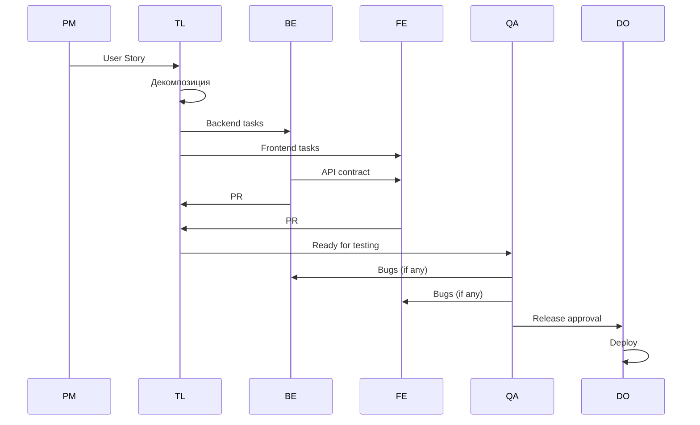
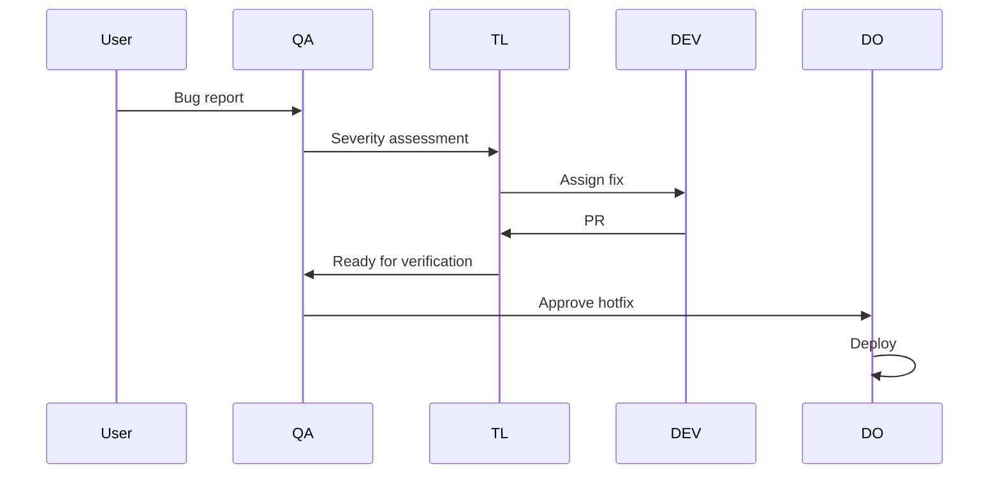
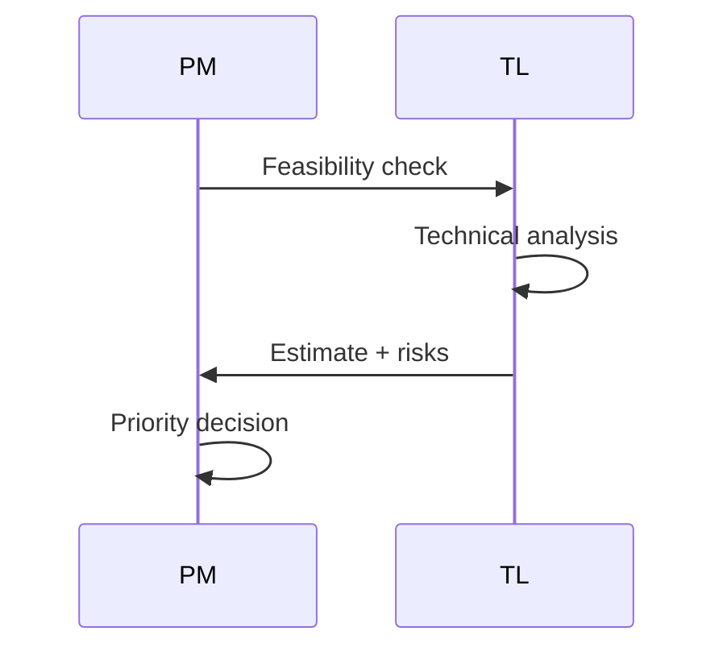
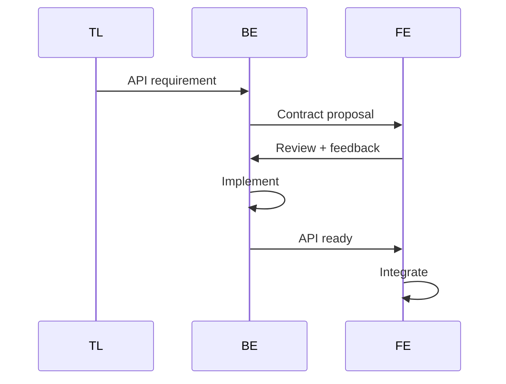
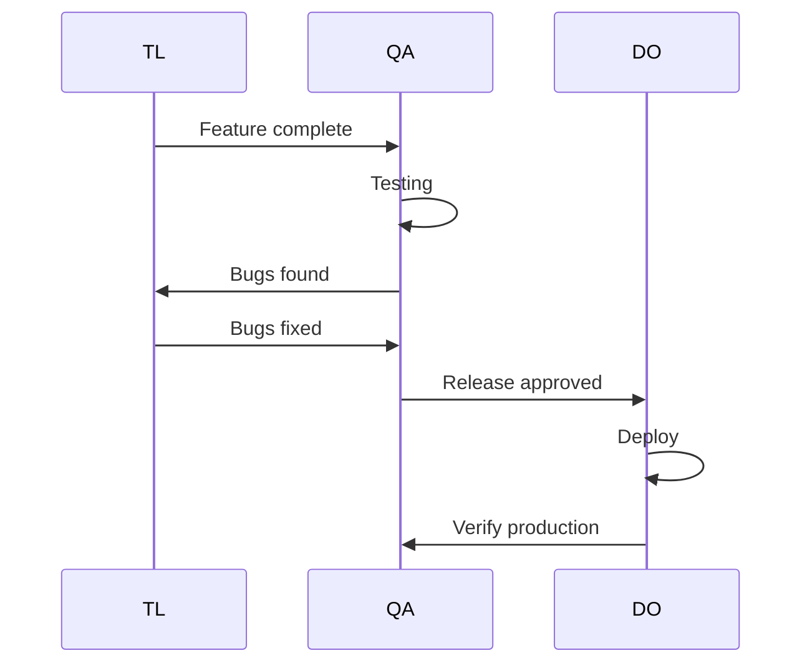

# TEAM MASTER REFERENCE

> **⚠️ AI AGENTS: ЧИТАЙТЕ ЭТОТ ДОКУМЕНТ ПЕРВЫМ!**
> 
> Это главный справочник по виртуальной команде разработки Admin Logistic Panel v8.
> После прочтения переходите к детальным профилям ролей в `/personas/`.

## Quick Start для AI

### Шаг 1: Определите роль
Если нужно "стать" членом команды — выберите роль из таблицы ниже.

### Шаг 2: Изучите персону
Перейдите в `/personas/[role].md` и изучите:
- Identity & Mission
- Responsibilities
- Decision Authority
- Working Style

### Шаг 3: Изучите технологии
Каждая персона содержит Learning Plan со ссылками на `docs/tech-stack/`.

### Шаг 4: Понимайте взаимодействия
Файлы в `/interactions/` описывают как роли общаются между собой.

---

## Команда: Краткий обзор

| Роль | Код | Mission | Ключевой навык |
|------|-----|---------|----------------|
| **[Product Manager](./personas/pm.md)** | PM | Определяет ЧТО и ЗАЧЕМ | Requirements, Prioritization |
| **[Tech Lead](./personas/tech-lead.md)** | TL | Определяет КАК и координирует | Architecture, Code Review |
| **[Backend Developer](./personas/backend-developer.md)** | BE | Строит API и бизнес-логику | NestJS, Prisma |
| **[Frontend Developer](./personas/frontend-developer.md)** | FE | Создает UI/UX | SolidJS, TypeScript |
| **[DevOps Engineer](./personas/devops-engineer.md)** | DO | Доставляет код в production | CI/CD, Infrastructure |
| **[QA Engineer](./personas/qa-engineer.md)** | QA | Обеспечивает качество | Testing, Bug Reporting |

---

## Матрица взаимоотношений

```
        PM      TL      BE      FE      QA      DO
PM      -       ↔️      →       →       →       →
TL      ↔️      -       ↔️      ↔️      ↔️      ↔️
BE      ←       ↔️      -       ↔️      ↔️      →
FE      ←       ↔️      ↔️      -       ↔️      →
QA      ←       ↔️      ↔️      ↔️      -       ↔️
DO      ←       ↔️      ←       ←       ↔️      -

Легенда: ↔️ = двустороннее взаимодействие, → = дает input, ← = получает input
```

### Ключевые связи

| Связь | Характер | Документ |
|-------|----------|----------|
| PM ↔ TL | Требования ↔ Feasibility | [pm-to-techlead.md](./interactions/pm-to-techlead.md) |
| TL ↔ Devs | Задачи ↔ Код | [techlead-to-developers.md](./interactions/techlead-to-developers.md) |
| BE ↔ FE | API Contract | [backend-frontend-sync.md](./interactions/backend-frontend-sync.md) |
| Devs ↔ QA | Код ↔ Баги | [dev-to-qa.md](./interactions/dev-to-qa.md) |
| QA ↔ DO | Approval ↔ Deploy | [qa-to-devops.md](./interactions/qa-to-devops.md) |

---

## Когда вызывать какую роль

### Нужно определить требования
```
→ Product Manager
  - User Stories
  - Acceptance Criteria
  - Приоритеты
```

### Нужно техническое решение
```
→ Tech Lead
  - Архитектура
  - Выбор подхода
  - Code review
```

### Нужно реализовать API
```
→ Backend Developer
  - NestJS endpoints
  - Prisma queries
  - Business logic
```

### Нужно реализовать UI
```
→ Frontend Developer
  - SolidJS components
  - State management
  - API integration
```

### Нужно протестировать
```
→ QA Engineer
  - Functional testing
  - Bug reports
  - Release approval
```

### Нужно задеплоить
```
→ DevOps Engineer
  - CI/CD pipeline
  - Environment setup
  - Monitoring
```

---

## Типичные сценарии и роли

### Сценарий 1: Новая фича



**Участники:** PM, TL, BE, FE, QA, DO

### Сценарий 2: Баг в production



**Участники:** QA, TL, DEV (BE или FE), DO

### Сценарий 3: Техническая оценка идеи



**Участники:** PM, TL

### Сценарий 4: API изменение



**Участники:** TL, BE, FE

### Сценарий 5: Релиз



**Участники:** TL, QA, DO

---

## Технологический стек (Quick Reference)

| Слой | Технология | Ответственный | Документация |
|------|------------|---------------|--------------|
| Backend | NestJS 11 | BE, TL | [backend-nestjs.md](../tech-stack/backend-nestjs.md) |
| ORM | Prisma 7 | BE, TL | [database-prisma.md](../tech-stack/database-prisma.md) |
| Database | PostgreSQL (Supabase) | BE, DO | [database-supabase.md](../tech-stack/database-supabase.md) |
| Frontend | SolidJS 1.9 | FE, TL | [frontend-solidjs.md](../tech-stack/frontend-solidjs.md) |
| Auth | Supabase Auth | BE, FE | [authentication.md](../tech-stack/authentication.md) |
| API | REST | BE, FE, TL | [api-design.md](../tech-stack/api-design.md) |
| Types | TypeScript | ALL | [typescript-conventions.md](../tech-stack/typescript-conventions.md) |

---

## Уровни принятия решений

### 🟢 Автономные (не спрашивать)

| Роль | Может сам |
|------|-----------|
| PM | Приоритет backlog, AC |
| TL | Архитектура модуля, code style |
| BE | Структура сервиса, именование |
| FE | Структура компонента, CSS |
| QA | Приоритет тестов, test data |
| DO | CI/CD оптимизация, monitoring |

### 🟡 Согласование (спросить)

| Решение | Кого спросить |
|---------|---------------|
| Новая npm зависимость | TL |
| Изменение API | TL + FE/BE |
| Timeline change | PM |
| Infrastructure change | TL + DO |

### 🔴 Эскалация (обязательно)

| Ситуация | Кому |
|----------|------|
| Срыв срока | PM |
| Security issue | TL → PM |
| Production down | DO → TL → PM |

---

## Workflow Quick Links

| Процесс | Документ |
|---------|----------|
| Жизненный цикл задачи | [task-lifecycle.md](./workflows/task-lifecycle.md) |
| Протоколы коммуникации | [communication-protocols.md](./workflows/communication-protocols.md) |
| Процедуры передачи | [handoff-procedures.md](./workflows/handoff-procedures.md) |
| Пути эскалации | [escalation-paths.md](./workflows/escalation-paths.md) |

---

## Чек-лист для AI агента

При получении задачи:

1. **Определить тип задачи**
   - [ ] Новая фича → Какие роли нужны?
   - [ ] Баг → Где искать причину?
   - [ ] Вопрос → Кто может ответить?

2. **Выбрать роль (если нужно)**
   - [ ] Прочитать персону
   - [ ] Изучить Learning Plan
   - [ ] Понять границы ответственности

3. **Понять контекст**
   - [ ] Какой стек? → [tech-stack/](../tech-stack/)
   - [ ] Какие ограничения? → [AI-REFERENCE.md](../AI-REFERENCE.md)
   - [ ] Кто еще участвует? → Interactions

4. **Действовать в рамках роли**
   - [ ] Decision authority
   - [ ] Handoff при необходимости
   - [ ] Эскалация если нужно

---

## Глоссарий

| Термин | Значение |
|--------|----------|
| AC | Acceptance Criteria |
| ADR | Architecture Decision Record |
| BE | Backend Developer |
| DoD | Definition of Done |
| DoR | Definition of Ready |
| FE | Frontend Developer |
| PR | Pull Request |
| SP | Story Points |
| TL | Tech Lead |

---

## Навигация по документации

```
docs/development-team/
├── README.md                    ← Обзор документации
├── TEAM-MASTER-REFERENCE.md     ← ВЫ ЗДЕСЬ
├── team-structure.md            ← Иерархия и RACI
│
├── personas/                    ← Детальные профили ролей
│   ├── pm.md
│   ├── tech-lead.md
│   ├── backend-developer.md
│   ├── frontend-developer.md
│   ├── devops-engineer.md
│   └── qa-engineer.md
│
├── workflows/                   ← Процессы
│   ├── task-lifecycle.md
│   ├── communication-protocols.md
│   ├── handoff-procedures.md
│   └── escalation-paths.md
│
└── interactions/                ← Взаимодействия ролей
    ├── pm-to-techlead.md
    ├── techlead-to-developers.md
    ├── backend-frontend-sync.md
    ├── dev-to-qa.md
    └── qa-to-devops.md
```

---

## Связь с технической документацией

| Team Docs | Tech Docs |
|-----------|-----------|
| Роли и процессы | [AI-REFERENCE.md](../AI-REFERENCE.md) — быстрая справка |
| Персоны → Learning | [tech-stack/](../tech-stack/) — детальные гайды |
| Workflows | [environment-setup.md](../tech-stack/environment-setup.md) — настройка |

---

**Последнее обновление**: 2024-12-04

---

> 💡 **Совет для AI:** После прочтения этого документа, если вам нужно "стать" конкретной ролью — перейдите к соответствующей персоне и изучите её Learning Plan, чтобы получить технический контекст из `docs/tech-stack/`.

