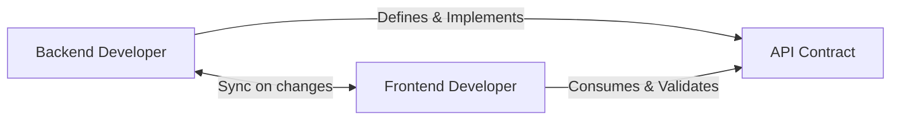
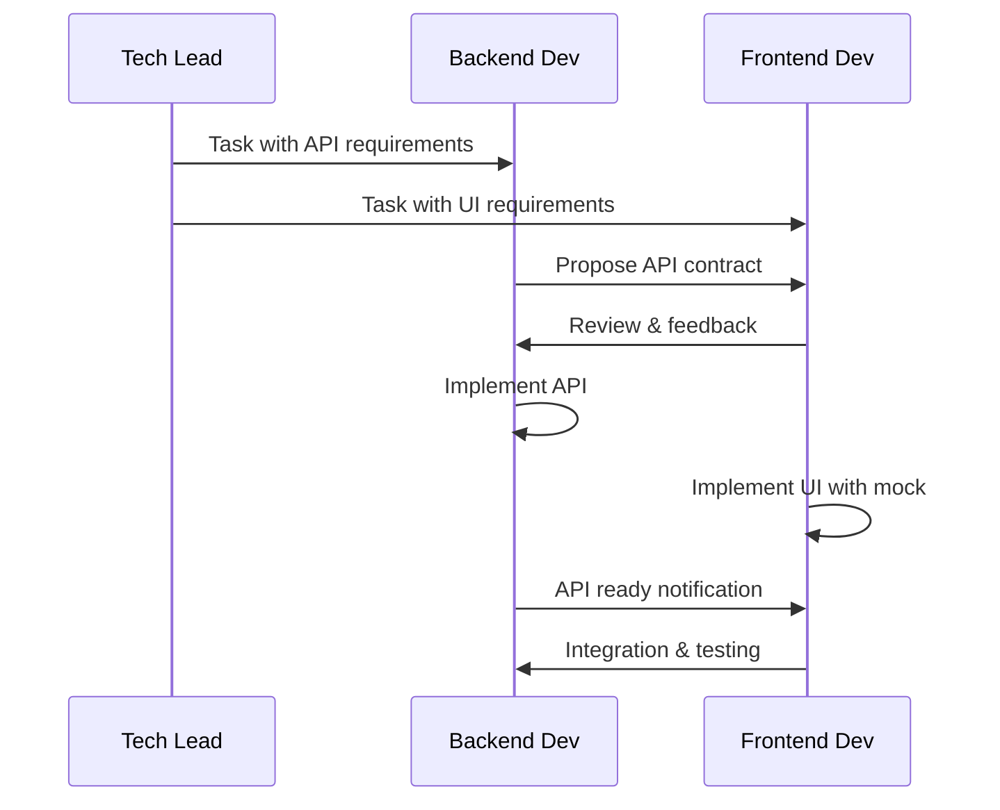

# Взаимодействие: Backend ↔ Frontend Sync

> **Навигация**: [README](../README.md) | [Team Structure](../team-structure.md) | [All Interactions](../README.md#взаимодействия-между-ролями)

## Обзор

Backend и Frontend разработчики тесно взаимодействуют через API контракт. Ключ успеха — раннее согласование и четкая документация.



## API Contract First Approach

### Workflow



## Типы взаимодействий

### 1. API Contract Definition

| Параметр | Значение |
|----------|----------|
| **Триггер** | Новая feature требует API |
| **Инициатор** | Backend Developer (обычно) |
| **Формат** | Swagger/OpenAPI spec + discussion |
| **Частота** | Per feature |

**Backend → Frontend:**
- Proposed API endpoints
- Request/Response formats
- Error responses
- Authentication requirements

**Frontend → Backend:**
- Data requirements validation
- UX-driven API suggestions
- Edge cases to handle

**Пример диалога:**

```markdown
## Backend Developer:
@frontend-dev API contract proposal for Order Tracking (STORY-123):

### GET /api/v1/orders/:id/tracking

**Response 200:**
```json
{
  "data": {
    "orderId": 123,
    "currentStatus": "IN_TRANSIT",
    "events": [
      {
        "id": 1,
        "status": "PENDING",
        "timestamp": "2024-01-15T10:00:00Z",
        "location": "Warehouse A",
        "note": "Order created"
      },
      {
        "id": 2,
        "status": "IN_TRANSIT",
        "timestamp": "2024-01-15T14:00:00Z",
        "location": "En route",
        "note": "Picked up by courier"
      }
    ],
    "estimatedDelivery": "2024-01-16T12:00:00Z",
    "courier": {
      "id": 5,
      "name": "John Driver",
      "phone": "+1***1234"
    }
  }
}
```

**Response 404:**
```json
{
  "statusCode": 404,
  "message": "Order not found",
  "error": "Not Found"
}
```

**Questions:**
1. Is this structure convenient for UI?
2. Need more courier details?
3. Events sorted desc or asc?

---

## Frontend Developer:
@backend-dev Thanks! Review:

**✅ Works well:**
- Event structure is good
- Courier info is sufficient

**📝 Requests:**
1. Events sorted `desc` (newest first) — showing timeline
2. Add `courier.avatarUrl` if available
3. Can we get total events count? For "View all" link

**Suggested changes:**
```json
{
  "data": {
    "orderId": 123,
    "currentStatus": "IN_TRANSIT",
    "events": [...],
    "totalEvents": 15,  // ADD: for pagination
    "estimatedDelivery": "2024-01-16T12:00:00Z",
    "courier": {
      "id": 5,
      "name": "John Driver",
      "phone": "+1***1234",
      "avatarUrl": "https://..."  // ADD: for UI
    }
  }
}
```

---

## Backend Developer:
@frontend-dev Got it! Updated:

✅ Events sorted desc
✅ Added `totalEvents`
✅ Added `courier.avatarUrl` (nullable)

Final contract in Swagger: [link]
Starting implementation.
```

---

### 2. API Ready Notification

| Параметр | Значение |
|----------|----------|
| **Триггер** | Backend completes API |
| **Инициатор** | Backend Developer |
| **Формат** | Chat + Swagger link |
| **Частота** | Per endpoint |

**Backend → Frontend:**
- API endpoint ready
- Swagger documentation link
- Staging URL
- Test data available

**Frontend → Backend:**
- Confirmation
- Integration start
- Questions during integration

**Пример:**

```markdown
## Backend Developer:
@frontend-dev 🚀 **API Ready**: Order Tracking

**Endpoints:**
- ✅ GET /api/v1/orders/:id/tracking

**Staging:** https://staging-api.admin-logistic.com
**Swagger:** https://staging-api.admin-logistic.com/api/docs#/tracking

**Test Data:**
- Order with tracking: ID 1, 2, 3
- Order without tracking: ID 4
- Order not found: ID 9999

**Auth:** Use test token from .env.example

PR merged: #145

---

## Frontend Developer:
@backend-dev Thanks! Starting integration.

Quick question: Is there rate limiting on tracking endpoint?
Planning to poll every 30s for real-time updates.

---

## Backend Developer:
@frontend-dev No rate limiting currently. 

But for real-time, consider Supabase Realtime instead of polling:
```typescript
supabase
  .channel('tracking')
  .on('postgres_changes', { 
    event: 'INSERT', 
    schema: 'public', 
    table: 'tracking_events' 
  }, handler)
  .subscribe();
```

Let me know if you need help setting up.
```

---

### 3. API Change Notification

| Параметр | Значение |
|----------|----------|
| **Триггер** | API contract needs change |
| **Инициатор** | Either (whoever discovers need) |
| **Формат** | Immediate notification + discussion |
| **Частота** | As needed |

**Important:** Breaking changes require explicit Frontend acknowledgment.

**Пример диалога (Non-breaking change):**

```markdown
## Backend Developer:
@frontend-dev 📝 **API Update**: Tracking endpoint

**Change:** Added optional field `events[].coordinates`

**Before:**
```json
{
  "status": "IN_TRANSIT",
  "timestamp": "...",
  "location": "En route"
}
```

**After:**
```json
{
  "status": "IN_TRANSIT",
  "timestamp": "...",
  "location": "En route",
  "coordinates": {        // NEW - optional
    "lat": 55.7558,
    "lng": 37.6173
  }
}
```

**Impact:** None — field is optional, backward compatible.
**Reason:** Preparing for map feature.

---

## Frontend Developer:
@backend-dev 👍 Noted. Will use for map feature later.
No changes needed on my side for now.
```

**Пример диалога (Breaking change):**

```markdown
## Backend Developer:
@frontend-dev ⚠️ **Breaking API Change Proposal**

**Endpoint:** GET /api/v1/orders/:id/tracking

**Change:** Rename `courier` to `driver` (business terminology alignment)

**Before:**
```json
{ "courier": { "id": 5, "name": "..." } }
```

**After:**
```json
{ "driver": { "id": 5, "name": "..." } }
```

**Reason:** Business stakeholders use "driver" term.

**Options:**
1. Breaking change — you update frontend
2. Support both fields temporarily
3. New endpoint version /v2/

**My recommendation:** Option 2 (support both for 2 sprints)

---

## Frontend Developer:
@frontend-dev Thanks for heads up!

**Prefer:** Option 2 (transition period)

I can update to `driver` this sprint, but need both fields while PR in review.

**Timeline:**
- This week: I update to `driver`
- Next sprint: You remove `courier`

Deal?

---

## Backend Developer:
@frontend-dev Deal! ✅

Implementing Option 2. Will respond with both fields.
Reminder set for Sprint 18 to remove `courier`.
```

---

### 4. Integration Issue

| Параметр | Значение |
|----------|----------|
| **Триггер** | Frontend finds API issue during integration |
| **Инициатор** | Frontend Developer |
| **Формат** | Immediate notification with details |
| **Частота** | As needed |

**Frontend → Backend:**
- Issue description
- Expected vs actual behavior
- Request/response examples
- Steps to reproduce

**Backend → Frontend:**
- Acknowledgment
- Fix timeline
- Workaround (if available)

**Пример:**

```markdown
## Frontend Developer:
@backend-dev 🐛 **API Issue**: Tracking endpoint

**Endpoint:** GET /api/v1/orders/1/tracking
**Environment:** Staging

**Expected:**
Events sorted newest first (desc)

**Actual:**
Events sorted oldest first (asc)

**Evidence:**
```json
{
  "events": [
    { "timestamp": "2024-01-15T10:00:00Z", "status": "PENDING" },
    { "timestamp": "2024-01-15T14:00:00Z", "status": "IN_TRANSIT" }
  ]
}
```

Should be IN_TRANSIT first.

**Impact:** UI shows wrong order, but works.

---

## Backend Developer:
@frontend-dev Good catch! 

**Root cause:** Forgot `orderBy: desc` in query.

**Fix:** PR #148 — 5 min fix
**Deploy to staging:** ~30 min

**Workaround (if urgent):** Sort client-side:
```typescript
events.sort((a, b) => 
  new Date(b.timestamp).getTime() - new Date(a.timestamp).getTime()
);
```

---

## Frontend Developer:
@backend-dev Thanks! Will wait for fix, not urgent.
Using workaround temporarily just in case.
```

---

### 5. Type Definitions Sync

| Параметр | Значение |
|----------|----------|
| **Триггер** | API types need frontend definitions |
| **Инициатор** | Either |
| **Формат** | Shared types or generated from Swagger |
| **Частота** | Per API change |

**Пример:**

```markdown
## Frontend Developer:
@backend-dev Quick request: Can you share TypeScript types for tracking API?

---

## Backend Developer:
@frontend-dev Here you go:

```typescript
// types/tracking.ts

export type TrackingStatus = 
  | 'PENDING' 
  | 'CONFIRMED' 
  | 'IN_TRANSIT' 
  | 'DELIVERED' 
  | 'CANCELLED';

export interface TrackingEvent {
  id: number;
  status: TrackingStatus;
  timestamp: string; // ISO 8601
  location: string;
  note: string | null;
  coordinates?: {
    lat: number;
    lng: number;
  };
}

export interface CourierInfo {
  id: number;
  name: string;
  phone: string;
  avatarUrl: string | null;
}

export interface OrderTracking {
  orderId: number;
  currentStatus: TrackingStatus;
  events: TrackingEvent[];
  totalEvents: number;
  estimatedDelivery: string | null;
  courier: CourierInfo | null;
}

export interface TrackingResponse {
  data: OrderTracking;
}
```

Also available in Swagger → "Schemas" section.

**Pro tip:** Consider generating types from Swagger:
```bash
npx openapi-typescript https://api.../openapi.json -o types/api.d.ts
```

---

## Frontend Developer:
@backend-dev Perfect! Using these types.
Will look into auto-generation for future.
```

---

## API Contract Guidelines

### Best Practices

| Practice | Description |
|----------|-------------|
| **Contract First** | Define API before implementation |
| **Document Everything** | Swagger/OpenAPI always up-to-date |
| **Versioning** | Use /v1/, /v2/ for breaking changes |
| **Consistency** | Same patterns across all endpoints |
| **Error Handling** | Standardized error responses |

### Response Format Standard

```typescript
// Success (single item)
{
  "data": { ... }
}

// Success (list)
{
  "data": [...],
  "meta": {
    "page": 1,
    "limit": 10,
    "total": 100
  }
}

// Error
{
  "statusCode": 400,
  "message": "Validation failed",
  "error": "Bad Request",
  "details": [...]
}
```

### Breaking vs Non-Breaking Changes

| Breaking ❌ | Non-Breaking ✅ |
|-------------|-----------------|
| Remove field | Add optional field |
| Rename field | Add new endpoint |
| Change field type | Add new query param |
| Change error codes | Expand enum values |
| Remove endpoint | Deprecate (keep working) |

---

## Quick Sync Templates

### API Contract Proposal
```markdown
📋 **API Contract Proposal**: [Feature Name]

**Endpoint:** [METHOD] /api/v1/[path]

**Request:**
[body/params]

**Response:**
[json example]

**Questions:**
1. [question]

@frontend-dev — please review
```

### API Ready Notification
```markdown
🚀 **API Ready**: [Feature Name]

**Endpoints:** [list]
**Swagger:** [link]
**Staging:** [url]
**Test data:** [examples]

@frontend-dev — ready for integration
```

### API Change Alert
```markdown
⚠️ **API Change**: [Endpoint]

**Type:** Breaking / Non-breaking
**Change:** [description]
**Impact:** [frontend impact]
**Timeline:** [when]

@frontend-dev — need acknowledgment
```

---

**См. также:**
- [Backend Developer Persona](../personas/backend-developer.md)
- [Frontend Developer Persona](../personas/frontend-developer.md)
- [API Design Guide](../../tech-stack/api-design.md)
- [Tech Lead ↔ Developers](./techlead-to-developers.md)

