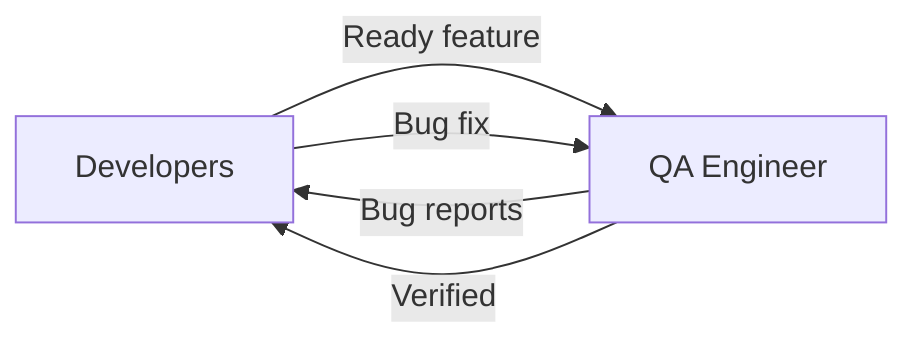

# Взаимодействие: Developers ↔ QA

> **Навигация**: [README](../README.md) | [Team Structure](../team-structure.md) | [All Interactions](../README.md#взаимодействия-между-ролями)

## Обзор

Developers и QA работают в цикле: Developers создают функционал → QA тестирует → Developers фиксят баги → QA верифицирует.



## Типы взаимодействий

### 1. Feature Handoff for Testing

| Параметр | Значение |
|----------|----------|
| **Триггер** | Feature code merged and deployed to staging |
| **Инициатор** | Developer (via Tech Lead often) |
| **Формат** | Jira status change + notification |
| **Частота** | Per feature |

**Developer → QA:**
- Feature ready notification
- Staging environment details
- Test data setup
- Known limitations
- Areas to focus testing

**QA → Developer:**
- Acknowledgment
- Questions about expected behavior
- Test start confirmation

**Пример диалога:**

```markdown
## Backend Developer:
@qa ✅ **Ready for Testing**: STORY-123 Order Tracking

**Deployed to:** Staging (https://staging.admin-logistic.com)
**PR:** #145, #147 (merged)
**Related tasks:** BE-201, BE-202

**What's New:**
- Order tracking page shows status history
- Real-time updates every 30s
- Courier information displayed

**Test Accounts:**
- Dispatcher: test-dispatcher@example.com / TestPass123
- Manager: test-manager@example.com / TestPass123

**Test Data:**
| Order ID | Status | Has Tracking | Courier |
|----------|--------|--------------|---------|
| 1 | DELIVERED | Yes (5 events) | John D. |
| 2 | IN_TRANSIT | Yes (2 events) | Jane S. |
| 3 | PENDING | No events | None |
| 4 | CANCELLED | Yes (3 events) | John D. |

**Known Limitations:**
- Real-time updates are polling (30s), not instant
- Map view coming in next sprint

**Focus Areas:**
- Status transition display
- Courier info masking (phone should show last 4 digits only)

**Acceptance Criteria:** [link to STORY-123]

---

## QA Engineer:
@backend-dev Thanks! Starting testing.

**Questions:**
1. For cancelled order (#4), should tracking still be visible?
2. Expected behavior when courier is not assigned yet?

---

## Backend Developer:
@qa Good questions:

1. Yes, cancelled orders still show tracking history (audit trail)
2. Courier section shows "Not assigned" text, no phone/avatar

Added to AC as clarifications.
```

---

### 2. Bug Report

| Параметр | Значение |
|----------|----------|
| **Триггер** | QA finds bug during testing |
| **Инициатор** | QA Engineer |
| **Формат** | Jira ticket + notification |
| **Частота** | Per bug found |

**QA → Developer:**
- Clear bug description
- Steps to reproduce
- Expected vs actual behavior
- Screenshots/videos
- Environment details
- Severity assessment

**Developer → QA:**
- Acknowledgment
- Clarifying questions (if needed)
- Fix timeline

**Пример:**

```markdown
## QA Engineer:
@backend-dev 🐛 **Bug Report**: BUG-234

**Title:** Courier phone not masked properly

**Environment:** Staging
**Story:** STORY-123
**Severity:** P3 (Medium)
**Browser:** Chrome 120

### Steps to Reproduce
1. Login as dispatcher
2. Navigate to Orders → Order #2
3. View tracking section
4. Look at courier phone number

### Expected
Phone shows masked: +1***1234

### Actual
Phone shows full number: +1234567890

### Screenshot
[attached: bug-234-screenshot.png]

### Notes
- Only happens for orders in IN_TRANSIT status
- DELIVERED orders show masked correctly

---

## Backend Developer:
@qa Thanks for detailed report!

**Analysis:** Found the issue — masking only applied in one code path.

**Fix:** PR #150 (in review)
**ETA:** Will be on staging in ~2 hours

Will ping when ready for verification.
```

---

### 3. Bug Clarification

| Параметр | Значение |
|----------|----------|
| **Триггер** | Developer needs more info about bug |
| **Инициатор** | Developer |
| **Формат** | Comment on bug ticket + chat |
| **Частота** | As needed |

**Developer → QA:**
- Specific questions
- Request for additional steps
- Environment/data questions

**QA → Developer:**
- Additional details
- Clarified reproduction steps
- More test data

**Пример:**

```markdown
## Backend Developer:
@qa Question about BUG-234:

Can't reproduce on my local. Questions:

1. Which courier ID was assigned to order #2?
2. Was the courier created before or after recent migration?
3. Can you share the Network tab response?

---

## QA Engineer:
@backend-dev Here's more info:

1. Courier ID: 5 (John Driver)
2. Created before migration (Jan 10)
3. Network response:

```json
{
  "courier": {
    "id": 5,
    "name": "John Driver",
    "phone": "+1234567890",
    "createdAt": "2024-01-10T..."
  }
}
```

Interesting: older couriers have different phone format in DB?

---

## Backend Developer:
@qa Got it! 

**Root cause:** Old couriers have phone without country code prefix.
Masking regex expects format `+X...` but old data is just `1234567890`.

Creating migration to fix data + updating masking logic.
```

---

### 4. Bug Fix Verification

| Параметр | Значение |
|----------|----------|
| **Триггер** | Developer deploys bug fix |
| **Инициатор** | Developer |
| **Формат** | Notification + Jira status |
| **Частота** | Per bug fix |

**Developer → QA:**
- Fix deployed notification
- What was fixed
- Any regression areas to check

**QA → Developer:**
- Verification result
- Close bug or reopen with details

**Пример:**

```markdown
## Backend Developer:
@qa ✅ **Fix Deployed**: BUG-234

**PR:** #150 (merged)
**Deployed to:** Staging

**Fix Details:**
- Updated masking regex to handle both formats
- Added migration for old phone data
- All phones now stored with country code

**Verify:**
1. Order #2 (was broken)
2. Order #1 (regression check)
3. Any new order with courier

---

## QA Engineer:
@backend-dev Verified! ✅

**Results:**
- ✅ Order #2: Phone masked correctly now
- ✅ Order #1: Still works (no regression)
- ✅ New order: Created new courier, masking works

**BUG-234:** Closing as fixed.

Thanks for quick turnaround!
```

---

### 5. Edge Case Discussion

| Параметр | Значение |
|----------|----------|
| **Триггер** | QA finds edge case, unclear if bug or by design |
| **Инициатор** | QA Engineer |
| **Формат** | Discussion before bug creation |
| **Частота** | As needed |

**QA → Developer:**
- Observed behavior
- Question about expected behavior
- Business context question

**Developer → QA (or involves PM):**
- Clarification if by design
- Bug confirmation if unexpected
- PM involved if business decision

**Пример:**

```markdown
## QA Engineer:
@backend-dev @pm Question about behavior:

**Scenario:**
Order #5 has status DELIVERED but courier info is null.

**What happens:**
Courier section shows "Not assigned" even though order was delivered.

**Question:**
Is this correct? Seems odd that delivered order has no courier.

**My guess:**
This is legacy data issue, not UI bug?

---

## Backend Developer:
@qa Good catch. This is data issue, not code bug.

**Explanation:**
- Order #5 is from before we added courier tracking
- Legacy orders don't have courier assignment

**Options:**
1. Show "Legacy order" instead of "Not assigned"
2. Hide courier section for legacy orders
3. Leave as is (accurate but confusing)

@pm — which approach for legacy data?

---

## PM:
@qa @backend-dev Thanks for flagging.

**Decision:** Option 1 — show "Legacy order - courier not tracked"

This is clearer for users. Low priority, add to backlog.

---

## QA Engineer:
@pm @backend-dev Got it. 

Creating low-priority story, not bug:
STORY-145: "Handle legacy orders without courier"

Continuing testing, won't block release for this.
```

---

### 6. Regression Alert

| Параметр | Значение |
|----------|----------|
| **Триггер** | QA finds regression in existing functionality |
| **Инициатор** | QA Engineer |
| **Формат** | High-priority notification |
| **Частота** | Hopefully rare |

**QA → Developer:**
- Regression description
- What was working before
- What's broken now
- Likely cause (recent PR if known)

**Developer → QA:**
- Investigation results
- Fix priority

**Пример:**

```markdown
## QA Engineer:
🔴 @backend-dev @tech-lead **Regression Alert**

**What broke:** Order list pagination

**Was working:** Yesterday (before PR #147)
**Broken after:** Today's deployment

**Symptoms:**
- Page 2 shows same orders as page 1
- Total count is wrong

**Severity:** P2 — core functionality affected

**Likely cause:** 
PR #147 touched order query (tracking relations added)

---

## Backend Developer:
@qa @tech-lead Investigating!

**Update (10 min later):**
Found it — `skip/take` accidentally removed when adding include.

**Fix:** PR #151 — hotfix
**ETA:** 30 minutes to staging

Sorry for the regression, will add test to prevent this.

---

## Tech Lead:
@qa @backend-dev 

Adding to PR checklist: verify pagination on list endpoints.

@backend-dev — merge fix, let's add integration test for this.

---

## QA Engineer:
@backend-dev Fix deployed? Will verify immediately.

---

## Backend Developer:
@qa Yes, staging updated. Please verify.

---

## QA Engineer:
@backend-dev ✅ **Verified** — pagination working correctly now.

Tested pages 1-5, counts are correct.
Thanks for quick fix!
```

---

## Quality Expectations

### Developer Responsibilities Before QA

| Checkbox | Description |
|----------|-------------|
| ✅ | Unit tests pass |
| ✅ | Self-tested happy path |
| ✅ | Self-tested error cases |
| ✅ | Code reviewed and merged |
| ✅ | Deployed to staging |
| ✅ | Test data available |
| ✅ | Known issues documented |

### QA Testing Scope

| Type | Coverage |
|------|----------|
| Functional | All Acceptance Criteria |
| Edge cases | Empty states, max values, invalid input |
| Regression | Related existing features |
| Cross-browser | Chrome, Firefox, Safari (as required) |
| API | Direct API testing via Postman |

---

## Bug Report Template

```markdown
## Bug: [Short descriptive title]

**Severity:** P1/P2/P3/P4
**Environment:** Staging/Production
**Story:** [link]
**Browser/Device:** 

### Steps to Reproduce
1. 
2. 
3. 

### Expected Result
[What should happen]

### Actual Result
[What actually happens]

### Screenshots/Video
[Attach evidence]

### Additional Notes
[Console errors, network responses, etc.]
```

---

## Communication Guidelines

### Developers → QA

| Do ✅ | Don't ❌ |
|-------|---------|
| Provide complete test info | Throw over the wall |
| Document known issues | Hide problems |
| Respond to bugs promptly | Ignore bug reports |
| Thank for thorough testing | Be defensive about bugs |

### QA → Developers

| Do ✅ | Don't ❌ |
|-------|---------|
| Write clear reproduction steps | Report "it doesn't work" |
| Include all relevant details | Assume developer knows context |
| Distinguish bugs from questions | File bug without investigation |
| Verify fixes promptly | Let fixed bugs sit |

---

**См. также:**
- [Backend Developer Persona](../personas/backend-developer.md)
- [Frontend Developer Persona](../personas/frontend-developer.md)
- [QA Engineer Persona](../personas/qa-engineer.md)
- [Task Lifecycle](../workflows/task-lifecycle.md)
- [Handoff Procedures](../workflows/handoff-procedures.md)

