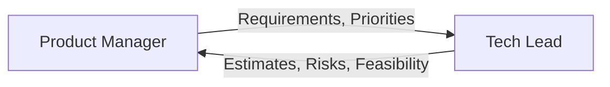

# Взаимодействие: PM ↔ Tech Lead

> **Навигация**: [README](../README.md) | [Team Structure](../team-structure.md) | [All Interactions](../README.md#взаимодействия-между-ролями)

## Обзор

Это ключевое взаимодействие в команде. PM определяет "что" и "зачем", Tech Lead определяет "как" и "сколько".



## Типы взаимодействий

### 1. Story Refinement

| Параметр | Значение |
|----------|----------|
| **Триггер** | Новая User Story требует технической оценки |
| **Инициатор** | PM |
| **Формат** | Grooming session или async review |
| **Частота** | 1-2 раза в неделю |

**PM → Tech Lead:**
- User Story с Acceptance Criteria
- Бизнес-контекст и приоритет
- Вопросы о технической возможности

**Tech Lead → PM:**
- Технические вопросы для уточнения
- Оценка сложности (story points)
- Технические риски и ограничения
- Предложения по упрощению

**Пример диалога:**

```markdown
## PM:
@tech-lead Новая story для Sprint 16:

**STORY-130: Order Export to Excel**

As a warehouse manager
I want to export orders to Excel
So that I can analyze them offline

**AC:**
1. Export button on orders list
2. Exports filtered orders
3. Includes all order fields
4. Maximum 10,000 rows

**Priority**: Medium
**Business context**: Manager requests this weekly for reporting.

Questions:
1. Is 10K rows feasible?
2. Any concerns?

---

## Tech Lead:
@pm Good story, несколько вопросов:

**Technical Questions:**
1. ✅ 10K rows feasible, but needs async generation
2. Format: .xlsx or .csv acceptable?
3. Should include related data (customer info, items)?

**Initial Assessment:**
- Complexity: Medium (3-5 SP)
- Approach: Backend generates file, frontend downloads
- Risk: Large exports may timeout — need background job

**Suggestion:**
For MVP: Limit to 5K rows with warning.
Later: Add email notification for large exports.

---

## PM:
@tech-lead Thanks for assessment!

Answers:
1. ✅ Async is fine
2. .xlsx preferred (manager uses Excel)
3. Yes, include customer name and order items count

Accepted suggestion: 5K limit for MVP.

Updated AC accordingly. Ready for sprint planning.
```

---

### 2. Sprint Planning

| Параметр | Значение |
|----------|----------|
| **Триггер** | Начало спринта |
| **Инициатор** | PM (организует), Tech Lead (ведет техническую часть) |
| **Формат** | Meeting (1-2 часа) |
| **Частота** | Раз в 2 недели |

**PM → Tech Lead:**
- Prioritized backlog
- Sprint goal
- Business constraints (deadlines, dependencies)

**Tech Lead → PM:**
- Team capacity
- Technical dependencies
- Recommended sprint scope
- Task decomposition

**Пример диалога:**

```markdown
## Sprint Planning: Sprint 16

### PM Opening:
Sprint Goal: "Users can export and track orders"

**Prioritized Stories:**
1. STORY-123: Order Tracking (8 SP) — HIGH
2. STORY-130: Excel Export (5 SP) — MEDIUM  
3. STORY-131: Dashboard Widget (3 SP) — LOW

Business constraint: Tracking needed by Jan 30 demo.

---

### Tech Lead Assessment:
**Team Capacity:** 35 SP

**Story Analysis:**

**STORY-123 (8 SP):**
- Backend: 5 SP
- Frontend: 3 SP
- Dependencies: External courier API integration
- Risk: API response time unknown

**STORY-130 (5 SP):**
- Backend: 3 SP
- Frontend: 2 SP
- No dependencies

**STORY-131 (3 SP):**
- Frontend only
- Depends on STORY-123 (needs tracking data)

**Recommendation:**
Take stories 1 + 2 = 13 SP + buffer for bugs/review.
STORY-131 depends on 123, risky for same sprint.

---

### PM Decision:
Agreed. Sprint 16 scope:
- STORY-123: Order Tracking ✅
- STORY-130: Excel Export ✅
- STORY-131: Move to Sprint 17

Sprint Goal confirmed: "Users can export and track orders"
```

---

### 3. Risk Communication

| Параметр | Значение |
|----------|----------|
| **Триггер** | Tech Lead идентифицирует риск для timeline/scope |
| **Инициатор** | Tech Lead |
| **Формат** | Immediate message + follow-up |
| **Частота** | As needed |

**Tech Lead → PM:**
- Описание риска
- Impact на delivery
- Варианты решения с trade-offs
- Рекомендация

**PM → Tech Lead:**
- Решение по варианту
- Изменение приоритетов (если нужно)
- Коммуникация stakeholders

**Пример диалога:**

```markdown
## Tech Lead:
🟠 @pm **Risk Alert: STORY-123**

**Issue:** 
External courier API (STORY-123) returns data in unexpected format.
Need additional parsing layer.

**Impact:**
- +2 SP effort
- 2-day delay for tracking feature
- Demo on Jan 30 at risk

**Options:**

| Option | Pros | Cons |
|--------|------|------|
| A: Full implementation | Complete feature | Miss demo deadline |
| B: Mock data for demo | Meet deadline | Demo not "real" data |
| C: Reduce scope | Partial tracking | Less impressive demo |

**Recommendation:** Option B
- Show real UI with mock data at demo
- Complete integration post-demo
- Stakeholders see progress

---

## PM:
@tech-lead Thanks for early heads up.

**Decision:** Option B approved.

I'll communicate to stakeholders:
- Demo will show UI/UX with representative data
- Live integration follows in Sprint 17

Please proceed and update STORY-123 notes.

---

## Tech Lead:
✅ Acknowledged. Updated story:
- Sprint 16: UI + mock data (5 SP)
- Sprint 17: API integration (3 SP)

Creating follow-up story STORY-135 for API work.
```

---

### 4. Feasibility Check

| Параметр | Значение |
|----------|----------|
| **Триггер** | PM рассматривает новую фичу |
| **Инициатор** | PM |
| **Формат** | Quick chat or async |
| **Частота** | As needed |

**PM → Tech Lead:**
- Описание идеи/фичи
- Бизнес-ценность
- Запрос на техническую оценку

**Tech Lead → PM:**
- Feasibility assessment
- Rough estimate
- Technical approach
- Concerns or alternatives

**Пример диалога:**

```markdown
## PM:
@tech-lead Quick feasibility check:

**Idea:** Real-time GPS tracking on map for deliveries

**Context:** 
Sales team wants to show live courier location to customers.
Could be competitive advantage.

**Questions:**
1. Is this feasible with our stack?
2. Rough effort estimate?
3. Any major blockers?

---

## Tech Lead:
@pm Good question! Quick assessment:

**Feasibility:** ✅ Possible, but significant effort

**Technical Approach:**
1. Need GPS data from courier app (we don't have this yet)
2. Real-time updates via Supabase Realtime (we use this)
3. Map integration (Mapbox or Google Maps)

**Rough Estimate:**
- MVP (static updates every 5 min): 2-3 sprints
- Full real-time (<1 min): 4-5 sprints

**Blockers:**
- 🔴 Courier app needs to send GPS — requires mobile dev
- 🟡 Map library license costs

**Alternatives:**
- Phase 1: Status updates with last known location (simpler)
- Phase 2: Real-time if Phase 1 successful

**Recommendation:**
Let's discuss in next grooming. Need to understand priority vs other roadmap items.

---

## PM:
@tech-lead Thanks! 

Valuable input. Will discuss with stakeholders about phased approach.
Adding to backlog for future grooming, not immediate priority.
```

---

### 5. Daily Sync

| Параметр | Значение |
|----------|----------|
| **Триггер** | Daily standup |
| **Инициатор** | Both |
| **Формат** | Standup or quick chat |
| **Частота** | Daily |

**Topics:**
- Sprint progress
- Blockers requiring PM input
- Priority clarifications
- Upcoming decisions

**Пример:**

```markdown
## Daily Sync Notes

**Tech Lead:**
- STORY-123 backend complete, frontend in progress
- No blockers
- Question: STORY-130 export — should filename include date?

**PM:**
- Yes, include date in filename: "orders_2024-01-15.xlsx"
- Stakeholder meeting tomorrow — may have new priority
- Heads up: possible urgent bug from customer

**Actions:**
- TL: Update export filename requirement
- PM: Update AC in Jira
- PM: Share stakeholder feedback after meeting
```

---

## Communication Guidelines

### PM → Tech Lead

| Do ✅ | Don't ❌ |
|-------|---------|
| Provide business context | Give technical solutions |
| Set clear priorities | Dictate how to implement |
| Share deadlines early | Surprise with urgent requests |
| Ask for feasibility | Assume everything is easy |
| Accept technical constraints | Push back on all estimates |

### Tech Lead → PM

| Do ✅ | Don't ❌ |
|-------|---------|
| Explain in business terms | Use excessive jargon |
| Provide options with trade-offs | Just say "no" |
| Raise risks early | Wait until deadline |
| Suggest alternatives | Block without solutions |
| Commit to realistic estimates | Over-promise |

---

## Artifacts Exchanged

| From | To | Artifact |
|------|-----|----------|
| PM | Tech Lead | User Stories with AC |
| PM | Tech Lead | Prioritized Backlog |
| PM | Tech Lead | Business constraints |
| Tech Lead | PM | Effort estimates |
| Tech Lead | PM | Technical risks |
| Tech Lead | PM | Task decomposition |
| Tech Lead | PM | Feasibility assessments |

---

**См. также:**
- [PM Persona](../personas/pm.md)
- [Tech Lead Persona](../personas/tech-lead.md)
- [Task Lifecycle](../workflows/task-lifecycle.md)
- [Communication Protocols](../workflows/communication-protocols.md)

