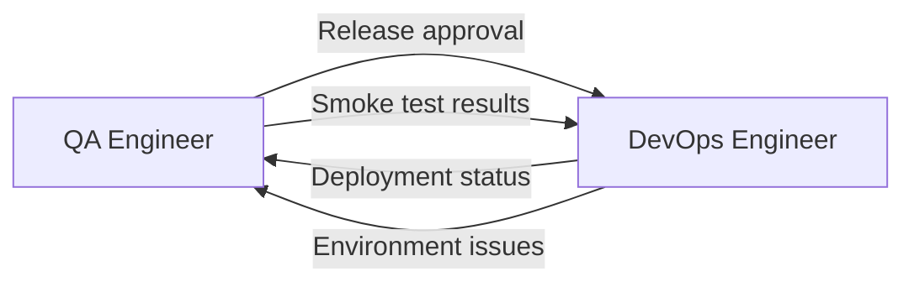

# Взаимодействие: QA ↔ DevOps

> **Навигация**: [README](../README.md) | [Team Structure](../team-structure.md) | [All Interactions](../README.md#взаимодействия-между-ролями)

## Обзор

QA и DevOps взаимодействуют на этапе релиза. QA дает "зеленый свет" для деплоя, DevOps выполняет deployment и информирует о результате.



## Типы взаимодействий

### 1. Release Approval (Sign-off)

| Параметр | Значение |
|----------|----------|
| **Триггер** | Sprint testing complete, ready for production |
| **Инициатор** | QA Engineer |
| **Формат** | Formal sign-off + notification |
| **Частота** | Per release (usually end of sprint) |

**QA → DevOps:**
- Release approval
- Tested version/commits
- Release notes summary
- Any known issues
- Rollback criteria

**DevOps → QA:**
- Acknowledgment
- Deployment schedule
- Any infrastructure concerns

**Пример диалога:**

```markdown
## QA Engineer:
@devops 🚀 **Release Approved**: v1.2.0

**Sprint:** Sprint 16
**Version:** v1.2.0
**Branch:** main (commit abc123)

### Testing Summary
| Metric | Result |
|--------|--------|
| Stories tested | 3/3 ✅ |
| Bugs found | 5 |
| Bugs fixed | 5/5 ✅ |
| Regression | Passed ✅ |
| Smoke test | Passed ✅ |

### Included Changes
- STORY-123: Order Tracking
- STORY-130: Excel Export
- FIX-234, FIX-235, FIX-236

### Known Issues
- None blocking release
- STORY-145 (legacy courier display) — low priority, next sprint

### Release Notes
[link to release notes doc]

### Rollback Criteria
If >5% error rate on `/api/v1/orders/tracking` endpoint within 30 min.

### Sign-off
- ✅ QA: @qa-engineer
- ✅ Tech Lead: @tech-lead (verbal)

**Approved for production deployment.**

---

## DevOps Engineer:
@qa Acknowledged! ✅

**Deployment Plan:**
- **When:** Today 16:00 UTC (low traffic window)
- **Duration:** ~15 minutes
- **Downtime:** None expected (zero-downtime deploy)

**Pre-deployment:**
- Database migrations: Yes (1 migration)
- Config changes: None
- Cache clear: Yes

**Monitoring:**
- Error rates: Will watch Sentry
- Performance: Will watch Datadog

Will notify when complete.

Any concerns with 16:00 UTC timing?

---

## QA Engineer:
@devops 16:00 UTC works. 

I'll be online to run production smoke test after deploy.
Please ping me when ready to verify.
```

---

### 2. Deployment Notification

| Параметр | Значение |
|----------|----------|
| **Триггер** | Deployment complete |
| **Инициатор** | DevOps Engineer |
| **Формат** | Team notification |
| **Частота** | Per deployment |

**DevOps → QA (and team):**
- Deployment status
- Version deployed
- Any issues during deploy
- Monitoring links
- Request for smoke test

**QA → DevOps:**
- Smoke test results
- Verification complete

**Пример:**

```markdown
## DevOps Engineer:
🎉 @qa @team **Deployed to Production**: v1.2.0

**Time:** 2024-01-16 16:05 UTC
**Duration:** 12 minutes
**Status:** ✅ Success

### Deployment Details
- Backend: ✅ Healthy
- Frontend: ✅ Healthy
- Database migration: ✅ Applied
- Cache: ✅ Cleared

### Health Checks
- API: 200 OK
- Frontend: Loading correctly
- Auth: Working

### Monitoring
- Sentry: [dashboard link]
- Datadog: [dashboard link]

### Initial Metrics (5 min post-deploy)
- Error rate: 0.1% (normal)
- Response time: 120ms avg (normal)
- Active users: 45 (normal for this time)

@qa — Please run production smoke test.

Rollback ready if needed (previous version saved).

---

## QA Engineer:
@devops Running smoke test now...

**Production Smoke Test Results:**

| Test | Result |
|------|--------|
| Login | ✅ Pass |
| Order List | ✅ Pass |
| Order Tracking (new) | ✅ Pass |
| Excel Export (new) | ✅ Pass |
| Create Order | ✅ Pass |
| Dashboard | ✅ Pass |

**Duration:** 8 minutes
**Issues found:** None

✅ **Production verified.** Release v1.2.0 successful!

---

## DevOps Engineer:
@qa @team Perfect! 

Release v1.2.0 is complete and verified.

Continuing to monitor. Will alert if any anomalies in next 2 hours.
```

---

### 3. Environment Issue Report

| Параметр | Значение |
|----------|----------|
| **Триггер** | QA finds environment/infrastructure issue |
| **Инициатор** | QA Engineer |
| **Формат** | Direct message + ticket |
| **Частота** | As needed |

**QA → DevOps:**
- Issue description
- Environment affected
- Impact on testing
- Urgency level

**DevOps → QA:**
- Investigation results
- Fix timeline
- Workaround (if available)

**Пример:**

```markdown
## QA Engineer:
@devops 🔴 **Staging Environment Issue**

**Problem:** Staging API returning 503 errors

**When started:** ~30 minutes ago
**Impact:** Cannot continue testing STORY-140

**Symptoms:**
- All API calls return 503
- Frontend shows "Service Unavailable"
- Database connection seems okay (can query directly)

**What I tried:**
- Refreshed browser
- Tried different endpoints
- Checked from different network

**Urgency:** High — blocking sprint testing

---

## DevOps Engineer:
@qa Looking into it now.

**Initial findings (5 min):**
- Server is up
- Logs show: "Connection pool exhausted"
- Cause: Looks like a runaway query from earlier today

**Fix:**
- Restarting backend service
- Increasing connection pool temporarily

**ETA:** 10 minutes

---

## DevOps Engineer:
@qa **Update:** Staging restored ✅

**Root cause:** Background job was holding connections
**Fix:** Killed stuck process, restarted service
**Prevention:** Added connection timeout config

Please verify and continue testing.

---

## QA Engineer:
@devops Verified — staging working again. ✅

Continuing with STORY-140 testing.
Thanks for quick resolution!
```

---

### 4. Test Environment Request

| Параметр | Значение |
|----------|----------|
| **Триггер** | QA needs new/modified environment |
| **Инициатор** | QA Engineer |
| **Формат** | Request ticket |
| **Частота** | As needed |

**QA → DevOps:**
- What's needed
- Why (context)
- When needed
- Any special config

**DevOps → QA:**
- Feasibility
- Timeline
- Access details

**Пример:**

```markdown
## QA Engineer:
@devops **Environment Request**: Load Testing Environment

**What:** Separate environment for performance testing
**Why:** Need to run load tests without affecting staging

**Requirements:**
- Copy of staging setup
- Same database schema (can use empty/seed data)
- API only (no frontend needed)
- Access for load testing tool (k6)

**When needed:** Before Sprint 17 (performance story planned)

**Duration:** Permanent (will use for ongoing perf testing)

---

## DevOps Engineer:
@qa Good request. Can do this.

**Plan:**
- Spin up new Railway environment: `perf-test`
- Clone staging config
- Empty database with seed data
- Same API version as staging

**Timeline:** 2 days
**Access:** Will share API URL and test credentials

**Note:** 
- Environment will be smaller (cost reasons)
- Fine for load testing scenarios
- Not for capacity planning (prod is bigger)

I'll ping when ready.

---

## DevOps Engineer:
@qa ✅ **Perf Test Environment Ready**

**API URL:** https://perf-test.admin-logistic.com
**Swagger:** https://perf-test.admin-logistic.com/api/docs

**Credentials:**
- Test user: loadtest@example.com / LoadTest123
- API key for automation: [shared securely]

**Database:**
- 10,000 seed orders
- 100 users
- 50 couriers

**Limits:**
- 2 CPU, 1GB RAM
- Database: 5GB

Let me know if you need adjustments.

---

## QA Engineer:
@devops Perfect! This is exactly what we need.

Will start setting up k6 scripts.
Thanks!
```

---

### 5. Rollback Request

| Параметр | Значение |
|----------|----------|
| **Триггер** | Critical issue found post-deployment |
| **Инициатор** | QA or Tech Lead |
| **Формат** | Urgent notification |
| **Частота** | Rare (hopefully) |

**QA → DevOps:**
- Rollback request
- Reason
- Severity

**DevOps → QA (and team):**
- Rollback execution
- Status updates
- Post-rollback verification request

**Пример:**

```markdown
## QA Engineer:
🚨 @devops @tech-lead **ROLLBACK NEEDED**

**Severity:** P1 — Critical
**Environment:** Production

**Issue:**
Users cannot complete orders — "Create Order" button gives 500 error.

**Impact:**
- Core functionality broken
- Multiple user reports in last 10 min
- Revenue impact

**Evidence:**
- Sentry: 50+ errors on POST /api/v1/orders
- Error: "Database constraint violation"

**Recommendation:**
Rollback to v1.1.0 immediately.

---

## DevOps Engineer:
@qa @tech-lead @team 🔴 **INITIATING ROLLBACK**

Rolling back to v1.1.0.
ETA: 5 minutes.

Everyone stand by.

---

## DevOps Engineer:
@qa @tech-lead @team **Rollback Complete**

**Status:** Production now on v1.1.0
**Time:** 16:45 UTC
**Duration:** 4 minutes

**Immediate check:**
- API health: ✅
- Error rate: Dropping

@qa — Please verify order creation works.

---

## QA Engineer:
@devops Testing...

✅ **Order creation works on v1.1.0.**

Rollback successful. Production is stable.

---

## Tech Lead:
@team Rollback verified. Production stable.

@backend-dev — Let's investigate the v1.2.0 issue before re-deploy.

Post-mortem scheduled for tomorrow.
```

---

## Release Checklist Template

```markdown
## Release Checklist: v[X.Y.Z]

### QA Sign-off
- [ ] All stories tested
- [ ] All bugs fixed
- [ ] Regression passed
- [ ] Smoke test passed
- [ ] Known issues documented
- [ ] Release notes prepared

### QA Approval
- [ ] QA Engineer: ___________
- [ ] Date: ___________

### DevOps Pre-deployment
- [ ] Migrations reviewed
- [ ] Config changes documented
- [ ] Rollback plan ready
- [ ] Monitoring alerts configured
- [ ] Deployment window confirmed

### Deployment
- [ ] Backend deployed
- [ ] Frontend deployed
- [ ] Migrations applied
- [ ] Health checks passed

### Post-deployment
- [ ] QA smoke test passed
- [ ] Error rates normal
- [ ] Performance normal
- [ ] Team notified

### Sign-off
- [ ] DevOps: ___________
- [ ] Date: ___________
```

---

## Communication Guidelines

### QA → DevOps

| Do ✅ | Don't ❌ |
|-------|---------|
| Provide clear release criteria | Rush approval without testing |
| Document known issues | Hide problems from release |
| Be available for post-deploy verification | Disappear after approval |
| Report environment issues with details | Just say "staging is broken" |

### DevOps → QA

| Do ✅ | Don't ❌ |
|-------|---------|
| Confirm deployment schedule | Deploy without notification |
| Notify immediately on issues | Let QA discover problems |
| Provide monitoring access | Keep logs inaccessible |
| Have rollback ready | Deploy without safety net |

---

**См. также:**
- [QA Engineer Persona](../personas/qa-engineer.md)
- [DevOps Engineer Persona](../personas/devops-engineer.md)
- [Task Lifecycle](../workflows/task-lifecycle.md)
- [Escalation Paths](../workflows/escalation-paths.md)

