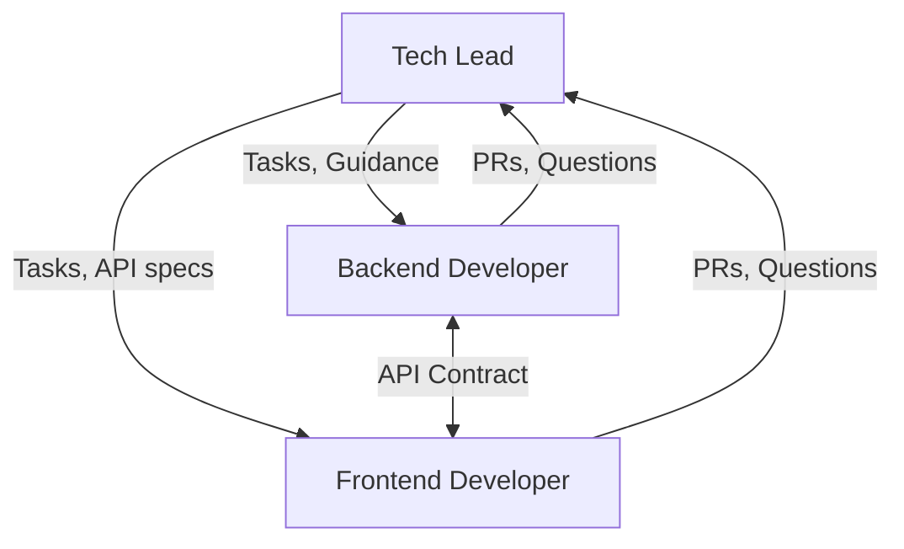
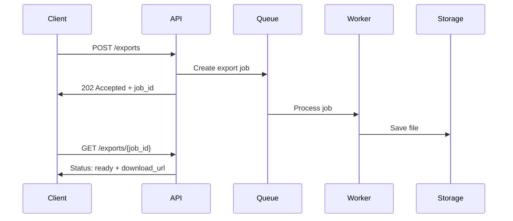

# Взаимодействие: Tech Lead ↔ Developers

> **Навигация**: [README](../README.md) | [Team Structure](../team-structure.md) | [All Interactions](../README.md#взаимодействия-между-ролями)

## Обзор

Tech Lead координирует работу Backend и Frontend разработчиков, обеспечивая качество кода и архитектурную согласованность.



## Типы взаимодействий

### 1. Task Assignment & Kickoff

| Параметр | Значение |
|----------|----------|
| **Триггер** | Sprint Planning завершен |
| **Инициатор** | Tech Lead |
| **Формат** | Jira + Chat notification |
| **Частота** | Начало каждого спринта |

**Tech Lead → Developer:**
- Assigned tasks
- Technical approach/guidance
- Dependencies и blockers
- Ожидания и Definition of Done

**Developer → Tech Lead:**
- Подтверждение понимания
- Вопросы по задаче
- Estimated completion time

**Пример диалога:**

```markdown
## Tech Lead:
@backend-dev @frontend-dev Sprint 16 tasks assigned:

### Backend Developer:
- **BE-201**: Order Tracking Module (3 SP)
- **BE-202**: Tracking API endpoints (2 SP)
- **BE-203**: Excel Export Service (3 SP)

### Frontend Developer:
- **FE-201**: Order Tracking UI (3 SP)
- **FE-202**: Export Button Component (2 SP)

**Dependencies:**
- FE-201 depends on BE-202 (API ready)
- Targeting BE-202 completion by Wed for FE integration

**Technical Notes:**
- Tracking: Use event sourcing pattern (see ADR-003)
- Export: Async generation with download link
- API contracts in #admin-logistic-dev

Questions? Let's sync in standup.

---

## Backend Dev:
@tech-lead Acknowledged. Questions:

1. BE-201: Should TrackingEvent include courier ID or embed courier data?
2. BE-203: Max file size for export before async?

---

## Tech Lead:
@backend-dev Good questions:

1. Include `courierId` only, fetch courier details on read (avoid data duplication)
2. > 1000 rows → async with job queue

Updated task descriptions with these details.

---

## Frontend Dev:
@tech-lead Got it. Starting with FE-202 (no backend dependency).
Will ping @backend-dev when need API for FE-201.
```

---

### 2. Code Review

| Параметр | Значение |
|----------|----------|
| **Триггер** | PR created |
| **Инициатор** | Developer |
| **Формат** | GitHub PR |
| **Частота** | Per PR (several times/week) |

**Developer → Tech Lead:**
- Pull Request с описанием
- Self-review completed
- Tests passing
- Specific areas для review (если есть)

**Tech Lead → Developer:**
- Code review comments
- Approval или change requests
- Educational feedback

**Пример диалога:**

```markdown
## Pull Request: BE-201 Order Tracking Module

**Developer submits PR:**

---
### Description
Implements order tracking module with event sourcing pattern.

### Changes
- Added TrackingEvent Prisma model
- Created tracking module (controller, service)
- Added migration for tracking_events table
- Unit tests for TrackingService

### Review Focus
- Event sourcing implementation — first time using this pattern
- Query optimization for getTrackingHistory

---

## Tech Lead Review:

### ✅ Approved with comments

**General:**
Good implementation! Event sourcing pattern looks correct.

**Comments:**

📍 **tracking.service.ts:45**
```typescript
// Current:
const events = await this.prisma.trackingEvent.findMany({
  where: { orderId },
  orderBy: { createdAt: 'desc' }
});

// Suggestion: Add limit for performance
const events = await this.prisma.trackingEvent.findMany({
  where: { orderId },
  orderBy: { createdAt: 'desc' },
  take: 100 // Prevent loading thousands of events
});
```

📍 **tracking.controller.ts:22**
Nice use of ValidationPipe! 👍

📍 **tracking.service.spec.ts**
Consider adding test for edge case: order with no events.

**Overall:**
Great work! Merge after addressing the limit suggestion.

---

## Developer Response:

@tech-lead Thanks for review!

✅ Added `take: 100` limit
✅ Added test for empty events case

Ready for re-review.

---

## Tech Lead:

✅ LGTM. Merging.
```

---

### 3. Technical Guidance / Pairing

| Параметр | Значение |
|----------|----------|
| **Триггер** | Developer stuck или complex task |
| **Инициатор** | Developer или Tech Lead |
| **Формат** | Pairing session, screen share |
| **Частота** | As needed |

**Developer → Tech Lead:**
- Описание проблемы
- What was tried
- Specific question

**Tech Lead → Developer:**
- Guidance/solution
- Explanation (educational)
- Documentation reference

**Пример диалога:**

```markdown
## Developer:
@tech-lead Need help with BE-203 (Excel Export).

**Problem:**
Trying to generate large Excel file (5000 rows), but request times out.

**What I tried:**
1. Streaming response — doesn't work with xlsx library
2. Increased timeout — not a real solution

**Question:**
How to handle async file generation properly?

---

## Tech Lead:
@backend-dev Good question! Let's solve this properly.

**Approach: Background Job Pattern**



**Implementation:**

1. Create `ExportJob` model:
```prisma
model ExportJob {
  id        String   @id @default(uuid())
  status    ExportStatus @default(PENDING)
  fileUrl   String?
  createdAt DateTime @default(now())
  error     String?
}

enum ExportStatus {
  PENDING
  PROCESSING
  COMPLETED
  FAILED
}
```

2. Controller returns job ID immediately:
```typescript
@Post('exports')
async createExport(@Body() dto: CreateExportDto) {
  const job = await this.exportService.createJob(dto);
  return { jobId: job.id, status: 'PENDING' };
}
```

3. Process in background (for now, simple setTimeout, later: proper queue):
```typescript
async createJob(dto: CreateExportDto) {
  const job = await this.prisma.exportJob.create({ data: {} });
  
  // Process async
  this.processExportJob(job.id, dto).catch(console.error);
  
  return job;
}
```

**Want to pair on this? Can do 30 min call.**

---

## Developer:
@tech-lead This is exactly what I needed! 

Pattern is clear. Will implement and PR.
Might ping for review on the async part.
```

---

### 4. Architecture Decision

| Параметр | Значение |
|----------|----------|
| **Триггер** | Developer proposes или needs decision |
| **Инициатор** | Developer или Tech Lead |
| **Формат** | Discussion + ADR if significant |
| **Частота** | As needed |

**Developer → Tech Lead:**
- Proposed approach
- Alternatives considered
- Trade-offs analysis

**Tech Lead → Developer:**
- Decision
- Rationale
- ADR (if significant change)

**Пример диалога:**

```markdown
## Frontend Developer:
@tech-lead Need decision for FE-201 (Tracking UI).

**Question:** How to handle real-time updates?

**Options:**

| Option | Pros | Cons |
|--------|------|------|
| A: Polling (30s) | Simple, works everywhere | Server load, not instant |
| B: Supabase Realtime | Instant, less load | More complex setup |
| C: Server-Sent Events | Middle ground | Backend changes needed |

**My recommendation:** Option B (Supabase Realtime)
- We already use Supabase
- Fits our stack
- Better UX

**Concerns:**
- Need to handle connection drops
- First time using this in frontend

---

## Tech Lead:
@frontend-dev Good analysis!

**Decision:** Option B ✅ (Supabase Realtime)

**Rationale:**
1. Aligns with stack (already use Supabase)
2. Better UX is worth small complexity
3. Learning investment pays off for future features

**Guidance for implementation:**

```typescript
// Basic pattern for SolidJS + Supabase Realtime
import { createEffect, onCleanup } from 'solid-js';
import { supabase } from '../supabase';

function useOrderTracking(orderId: number) {
  const [events, setEvents] = createSignal<TrackingEvent[]>([]);

  createEffect(() => {
    // Initial fetch
    fetchEvents(orderId).then(setEvents);

    // Subscribe to changes
    const subscription = supabase
      .channel(`order-${orderId}`)
      .on('postgres_changes', 
        { event: 'INSERT', schema: 'public', table: 'tracking_events', filter: `order_id=eq.${orderId}` },
        (payload) => {
          setEvents(prev => [...prev, payload.new as TrackingEvent]);
        }
      )
      .subscribe();

    onCleanup(() => {
      subscription.unsubscribe();
    });
  });

  return events;
}
```

**Handle disconnects:**
- Supabase client auto-reconnects
- Add visual indicator for connection status

No ADR needed — using existing tech in expected way.

---

## Frontend Developer:
@tech-lead Perfect! Pattern is clear.

Will implement with connection status indicator.
```

---

### 5. Daily Standup Updates

| Параметр | Значение |
|----------|----------|
| **Триггер** | Daily standup |
| **Инициатор** | All |
| **Формат** | Standup meeting or async |
| **Частота** | Daily |

**Developer → Tech Lead:**
- Yesterday's progress
- Today's plan
- Blockers

**Tech Lead → Developer:**
- Unblock если нужно
- Priority changes
- Sync points с другими devs

**Пример:**

```markdown
## Daily Standup: Jan 16

### Backend Developer:
**Yesterday:** 
- ✅ Completed BE-201 (PR merged)
- Started BE-202 API endpoints

**Today:**
- Continue BE-202
- Should be ready for frontend by EOD

**Blockers:** None

---

### Frontend Developer:
**Yesterday:**
- ✅ Completed FE-202 (Export button)
- Started FE-201 tracking UI

**Today:**
- Continue FE-201
- Need BE-202 API to test integration

**Blockers:** 
- Waiting for BE-202 (expected EOD)

---

### Tech Lead:
**Sync points:**
- @backend-dev — prioritize BE-202 for frontend unblock
- @frontend-dev — use mock data until API ready, share Postman collection
- Code review: BE-201 was good, tracking pattern well implemented

**Today focus:**
- Review BE-202 when ready
- Prepare integration test plan

No blockers escalated.
```

---

## Communication Guidelines

### Tech Lead → Developers

| Do ✅ | Don't ❌ |
|-------|---------|
| Provide clear task descriptions | Assign vague tasks |
| Explain "why" not just "what" | Micromanage implementation |
| Give educational feedback | Just fix their code |
| Set clear expectations | Change requirements mid-task |
| Be available for questions | Be unreachable |

### Developers → Tech Lead

| Do ✅ | Don't ❌ |
|-------|---------|
| Ask questions early | Struggle silently |
| Propose solutions | Just report problems |
| Update on progress | Go dark for days |
| Flag blockers immediately | Wait until deadline |
| Follow conventions | Invent new patterns without discussion |

---

## Artifacts Exchanged

| From | To | Artifact |
|------|-----|----------|
| Tech Lead | Developers | Task descriptions |
| Tech Lead | Developers | Architecture guidance |
| Tech Lead | Developers | Code review feedback |
| Tech Lead | Frontend Dev | API specifications |
| Developers | Tech Lead | Pull Requests |
| Developers | Tech Lead | Progress updates |
| Developers | Tech Lead | Technical questions |

---

**См. также:**
- [Tech Lead Persona](../personas/tech-lead.md)
- [Backend Developer Persona](../personas/backend-developer.md)
- [Frontend Developer Persona](../personas/frontend-developer.md)
- [Task Lifecycle](../workflows/task-lifecycle.md)
- [Backend-Frontend Sync](./backend-frontend-sync.md)

