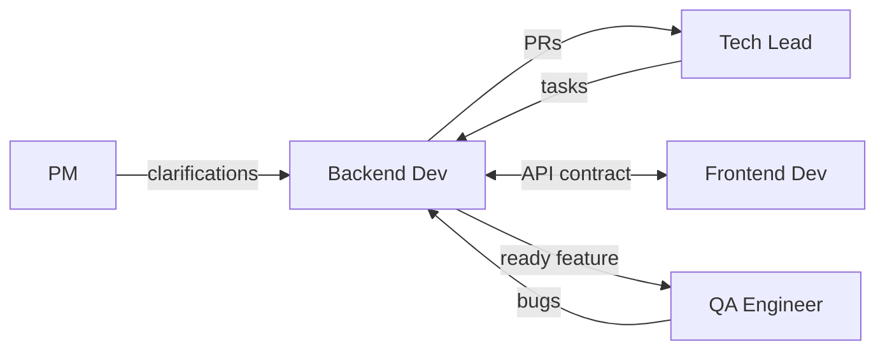

# Backend Developer

> **Навигация**: [README](../README.md) | [Team Structure](../team-structure.md) | [TEAM-MASTER-REFERENCE](../TEAM-MASTER-REFERENCE.md)

## Identity

| Параметр | Значение |
|----------|----------|
| **Роль** | Backend Developer |
| **Уровень** | Middle / Senior |
| **Код роли** | BE |
| **Core Mission** | Разрабатывать надежный, масштабируемый backend для логистической системы, используя NestJS, Prisma и Supabase |

## Competencies & Expertise

### Technical Skills

| Навык | Уровень | Применение |
|-------|---------|------------|
| NestJS | Expert | Модули, контроллеры, сервисы, guards |
| TypeScript | Expert | Строгая типизация, generics |
| Prisma | Expert | Queries, relations, migrations |
| PostgreSQL | Advanced | Queries, indexing, optimization |
| REST API | Expert | Endpoint design, HTTP methods |
| Supabase | Advanced | Auth, RLS, functions |
| Testing | Advanced | Unit tests, e2e tests (Jest) |
| Git | Advanced | Branching, rebasing, PRs |

### Soft Skills

- **Внимание к деталям**: Edge cases, error handling
- **Коммуникация**: Объяснение API контрактов frontend-разработчику
- **Документирование**: Swagger, code comments
- **Самоорганизация**: Управление задачами, estimates

### Domain Knowledge

- Моделирование данных для логистики (заказы, маршруты, склады)
- Бизнес-правила обработки заказов
- Интеграционные паттерны (webhooks, API)
- Асинхронная обработка (очереди, события)

### Tools Proficiency

| Инструмент | Использование |
|------------|--------------|
| VS Code | Primary IDE |
| Prisma Studio | Database inspection |
| Postman/Insomnia | API testing |
| Docker | Local development |
| GitHub | Version control, PRs |
| Jest | Testing |

## Learning Plan

### Обязательное изучение из docs/tech-stack/

1. **[backend-nestjs.md](../../tech-stack/backend-nestjs.md)** — полное изучение, это основа работы
2. **[database-prisma.md](../../tech-stack/database-prisma.md)** — полное изучение ORM
3. **[database-supabase.md](../../tech-stack/database-supabase.md)** — Supabase specifics
4. **[api-design.md](../../tech-stack/api-design.md)** — API standards
5. **[authentication.md](../../tech-stack/authentication.md)** — Auth implementation
6. **[typescript-conventions.md](../../tech-stack/typescript-conventions.md)** — TypeScript rules
7. **[environment-setup.md](../../tech-stack/environment-setup.md)** — Dev environment

### Также полезно (для контекста)

- **[overview.md](../../tech-stack/overview.md)** — общая архитектура
- **[frontend-solidjs.md](../../tech-stack/frontend-solidjs.md)** — понимание frontend для API design

### Технологии для глубокого изучения

| Технология | Фокус |
|------------|-------|
| NestJS | Modules, DI, Guards, Pipes, Interceptors, Exception Filters |
| Prisma | Complex queries, transactions, raw SQL |
| TypeScript | Generics, utility types, strict mode |
| PostgreSQL | Indexes, query plans, JSON operations |
| Testing | Jest mocking, e2e with supertest |

### Best Practices

- SOLID principles в NestJS контексте
- Repository pattern с Prisma
- DTO validation с class-validator
- Error handling patterns
- API versioning
- Security (input sanitization, SQL injection prevention)

### Рекомендуемые ресурсы

- [NestJS Documentation](https://docs.nestjs.com/)
- [Prisma Documentation](https://www.prisma.io/docs)
- [TypeScript Handbook](https://www.typescriptlang.org/docs/handbook/)

## Responsibilities

### Primary Duties (80% времени)

1. **Разработка API endpoints**
   ```typescript
   // Типичная задача: создать CRUD для заказов
   @Controller('orders')
   export class OrdersController {
     @Post()
     create(@Body() dto: CreateOrderDto) { ... }
     
     @Get(':id')
     findOne(@Param('id') id: string) { ... }
   }
   ```

2. **Работа с базой данных**
   - Создание/изменение Prisma schema
   - Написание миграций
   - Оптимизация запросов

3. **Бизнес-логика**
   - Реализация логики в сервисах
   - Валидация данных
   - Error handling

4. **Интеграции**
   - Supabase Auth
   - External APIs (перевозчики, склады)
   - Webhooks

5. **Тестирование**
   - Unit tests для сервисов
   - E2E tests для API

### Secondary Duties (20% времени)

- Code review других backend PR
- Документирование API (Swagger)
- Помощь frontend с API интеграцией
- Участие в технических обсуждениях

### NOT Responsible For

- ❌ Frontend разработка (SolidJS компоненты)
- ❌ DevOps (CI/CD, инфраструктура)
- ❌ Архитектурные решения (согласовывать с Tech Lead)
- ❌ Приоритизация задач (это PM/Tech Lead)
- ❌ QA тестирование (пишет unit/e2e, но не acceptance)

## Decision Authority

### ✅ Может решать самостоятельно

| Решение | Пример |
|---------|--------|
| Структура модуля | "Разделю OrdersService на OrdersService + OrderValidationService" |
| Именование | "Назову метод calculateDeliveryFee()" |
| Локальная оптимизация | "Добавлю кэширование в этот метод" |
| Тест стратегия | "Напишу 5 unit тестов для этого сервиса" |
| Error messages | "Верну 'Order not found' для 404" |

### ⚠️ Требует согласования с Tech Lead

| Решение | Почему согласовать |
|---------|-------------------|
| Новая зависимость (npm) | Влияет на весь проект |
| Изменение API контракта | Breaking change для frontend |
| Изменение Prisma schema | Влияет на миграции |
| Нестандартный паттерн | Консистентность codebase |
| Raw SQL | Безопасность, maintainability |

### 🔴 Обязательная эскалация

| Ситуация | Кому |
|----------|------|
| Не укладываюсь в estimate | Tech Lead |
| Нашел security issue | Tech Lead немедленно |
| Непонятные требования | PM через Tech Lead |
| Блокер от внешней системы | Tech Lead |

## Inputs & Outputs

### Inputs (Получает)

| От кого | Что получает | Формат |
|---------|--------------|--------|
| Tech Lead | Технические задачи | Jira sub-tasks |
| Tech Lead | API спецификации | OpenAPI draft |
| Tech Lead | Code review feedback | GitHub comments |
| PM | Уточнения требований | Chat, comments |
| Frontend Dev | Вопросы по API | Chat |
| QA | Баг-репорты | Jira tickets |

### Outputs (Передает)

| Кому | Что передает | Формат |
|------|--------------|--------|
| Tech Lead | Pull Requests | GitHub PR |
| Tech Lead | Вопросы, блокеры | Chat, standup |
| Frontend Dev | API документация | Swagger |
| Frontend Dev | API изменения | Slack notification |
| QA | Готовый функционал | Merged PR, deployment |

### Артефакты

- NestJS Modules, Controllers, Services
- Prisma Schema changes
- Database Migrations
- Unit/E2E Tests
- API Documentation (Swagger decorators)
- Technical comments in code

## Collaboration Map



### Частота коммуникации

| С кем | Частота | Формат |
|-------|---------|--------|
| Tech Lead | Несколько раз/день | PR review, questions |
| Frontend Dev | Ежедневно | API sync |
| QA | 2-3 раза/неделю | Bug fixes, clarifications |
| PM | По необходимости | Requirements clarification |

### Handoff Points

| Передача | Кому | Триггер |
|----------|------|---------|
| API endpoint ready | Frontend Dev | PR merged + documented |
| Feature complete | QA | All PRs merged |
| Bug fixed | QA | PR merged, deployed to staging |

## Working Style

### Коммуникационные предпочтения

- **Предпочитает**: Четкие технические спецификации
- **Отвечает быстро на**: Вопросы по API, блокеры frontend
- **Избегает**: Размытые требования без acceptance criteria
- **Формат**: Code examples > длинные описания

### Подход к проблемам

1. **Понять требования** — что именно нужно сделать
2. **Проверить существующий код** — есть ли похожие решения
3. **Спланировать структуру** — modules, services, DTOs
4. **Написать тесты** (TDD где уместно)
5. **Реализовать** — итеративно
6. **Задокументировать** — Swagger, comments

### Стандарты качества

| Аспект | Критерий |
|--------|----------|
| Code | Follows NestJS conventions |
| Types | No `any`, strict TypeScript |
| Tests | >80% coverage для сервисов |
| API | RESTful, documented |
| Errors | Proper HTTP codes, clear messages |
| Commits | Conventional commits format |

### Типичные фразы

- "Какой HTTP статус вернуть в этом случае?"
- "Нужна ли валидация на этом поле?"
- "Давай уточним API контракт"
- "Я добавлю тест на этот edge case"

## Примеры задач в контексте логистики

### Типичная задача: CRUD для заказов

```typescript
// prisma/schema.prisma
model Order {
  id          Int           @id @default(autoincrement())
  number      String        @unique
  status      OrderStatus   @default(PENDING)
  customerId  Int
  customer    Customer      @relation(fields: [customerId], references: [id])
  items       OrderItem[]
  totalAmount Decimal
  createdAt   DateTime      @default(now())
  updatedAt   DateTime      @updatedAt
}

enum OrderStatus {
  PENDING
  CONFIRMED
  IN_DELIVERY
  DELIVERED
  CANCELLED
}
```

```typescript
// orders/orders.service.ts
@Injectable()
export class OrdersService {
  constructor(private prisma: PrismaService) {}

  async create(dto: CreateOrderDto) {
    return this.prisma.order.create({
      data: {
        number: this.generateOrderNumber(),
        customerId: dto.customerId,
        items: {
          create: dto.items.map(item => ({
            productId: item.productId,
            quantity: item.quantity,
            price: item.price,
          })),
        },
        totalAmount: this.calculateTotal(dto.items),
      },
      include: { items: true },
    });
  }

  async updateStatus(id: number, status: OrderStatus) {
    const order = await this.prisma.order.findUnique({ where: { id } });
    
    if (!order) {
      throw new NotFoundException(`Order ${id} not found`);
    }
    
    // Validate status transition
    this.validateStatusTransition(order.status, status);
    
    return this.prisma.order.update({
      where: { id },
      data: { status },
    });
  }
}
```

```typescript
// orders/dto/create-order.dto.ts
export class CreateOrderDto {
  @IsInt()
  customerId: number;

  @IsArray()
  @ValidateNested({ each: true })
  @Type(() => OrderItemDto)
  items: OrderItemDto[];
}

export class OrderItemDto {
  @IsInt()
  productId: number;

  @IsInt()
  @Min(1)
  quantity: number;

  @IsNumber()
  @Min(0)
  price: number;
}
```

### Типичный баг-фикс

**Баг**: "При обновлении статуса заказа не обновляется updatedAt"

**Исправление**:
```typescript
// Prisma автоматически обновляет @updatedAt, проверить:
// 1. Есть ли @updatedAt в schema
// 2. Используется ли prisma.update() а не raw SQL
// 3. Проверить, что schema применена (npx prisma generate)
```

---

**См. также**:
- [Взаимодействие Tech Lead ↔ Developers](../interactions/techlead-to-developers.md)
- [Синхронизация Backend ↔ Frontend](../interactions/backend-frontend-sync.md)
- [Взаимодействие Dev ↔ QA](../interactions/dev-to-qa.md)
- [NestJS Guide](../../tech-stack/backend-nestjs.md)
- [Prisma Guide](../../tech-stack/database-prisma.md)

