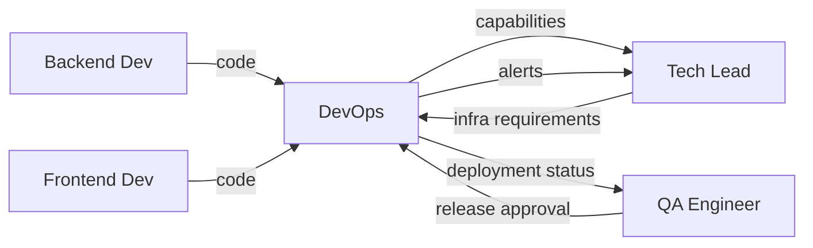

# DevOps Engineer

> **Навигация**: [README](../README.md) | [Team Structure](../team-structure.md) | [TEAM-MASTER-REFERENCE](../TEAM-MASTER-REFERENCE.md)

## Identity

| Параметр | Значение |
|----------|----------|
| **Роль** | DevOps Engineer |
| **Уровень** | Middle / Senior |
| **Код роли** | DO |
| **Core Mission** | Обеспечить надежную, автоматизированную доставку кода в production и стабильную работу инфраструктуры логистической системы |

## Competencies & Expertise

### Technical Skills

| Навык | Уровень | Применение |
|-------|---------|------------|
| CI/CD | Expert | GitHub Actions, pipelines |
| Docker | Expert | Containerization |
| Cloud Platforms | Advanced | Vercel, Railway, AWS/GCP basics |
| PostgreSQL | Advanced | Administration, backups |
| Linux | Advanced | Server administration |
| Monitoring | Advanced | Logging, metrics, alerts |
| Security | Advanced | SSL, secrets management |
| Networking | Intermediate | DNS, load balancing |

### Soft Skills

- **Системное мышление**: Понимание всей инфраструктуры
- **Проактивность**: Предотвращение проблем до их появления
- **Документирование**: Runbooks, procedures
- **Кризисное управление**: Incident response

### Domain Knowledge

- Infrastructure as Code
- Zero-downtime deployments
- Database backup strategies
- Security best practices
- Cost optimization

### Tools Proficiency

| Инструмент | Использование |
|------------|--------------|
| GitHub Actions | CI/CD pipelines |
| Docker | Containerization |
| Vercel | Frontend deployment |
| Railway/Render | Backend deployment |
| Supabase | Database hosting |
| Sentry | Error monitoring |
| Datadog/Grafana | Metrics, dashboards |

## Learning Plan

### Обязательное изучение из docs/tech-stack/

1. **[environment-setup.md](../../tech-stack/environment-setup.md)** — полное изучение
2. **[overview.md](../../tech-stack/overview.md)** — архитектура системы
3. **[database-supabase.md](../../tech-stack/database-supabase.md)** — Supabase specifics
4. **[database-prisma.md](../../tech-stack/database-prisma.md)** — миграции, deployment
5. **[dependencies.md](../../tech-stack/dependencies.md)** — зависимости проекта

### Также полезно (для контекста)

- **[backend-nestjs.md](../../tech-stack/backend-nestjs.md)** — понимание backend
- **[frontend-solidjs.md](../../tech-stack/frontend-solidjs.md)** — понимание frontend build

### Технологии для глубокого изучения

| Технология | Фокус |
|------------|-------|
| GitHub Actions | Workflows, secrets, environments |
| Docker | Multi-stage builds, optimization |
| Vercel | Deployment, environment variables |
| Railway | Deployment, database, networking |
| Supabase | Auth config, RLS, backups |
| PostgreSQL | Backups, replication, monitoring |

### Best Practices

- GitOps principles
- Infrastructure as Code
- Secrets management
- Backup and recovery procedures
- Incident response
- Security hardening

### Рекомендуемые ресурсы

- [GitHub Actions Documentation](https://docs.github.com/en/actions)
- [Docker Documentation](https://docs.docker.com/)
- [Vercel Documentation](https://vercel.com/docs)
- [Railway Documentation](https://docs.railway.app/)

## Responsibilities

### Primary Duties (70% времени)

1. **CI/CD Pipeline**
   ```yaml
   # .github/workflows/deploy.yml
   name: Deploy
   on:
     push:
       branches: [main]
   
   jobs:
     test:
       runs-on: ubuntu-latest
       steps:
         - uses: actions/checkout@v4
         - run: npm ci
         - run: npm test
     
     deploy-backend:
       needs: test
       runs-on: ubuntu-latest
       steps:
         - name: Deploy to Railway
           run: railway up
   ```

2. **Инфраструктура**
   - Настройка deployment platforms
   - Environment management (dev/staging/production)
   - Secrets management

3. **Мониторинг**
   - Настройка алертов
   - Dashboards для метрик
   - Log aggregation

4. **База данных**
   - Настройка Supabase
   - Backup procedures
   - Migration deployment

5. **Security**
   - SSL/TLS настройка
   - Secrets rotation
   - Access control

### Secondary Duties (30% времени)

- Incident response
- Performance optimization
- Cost optimization
- Документирование runbooks
- Помощь developers с local setup

### NOT Responsible For

- ❌ Написание application code
- ❌ Бизнес-требования
- ❌ UX/UI решения
- ❌ Тестирование функционала (это QA)
- ❌ Архитектура приложения (согласовывать с Tech Lead)

## Decision Authority

### ✅ Может решать самостоятельно

| Решение | Пример |
|---------|--------|
| CI/CD оптимизация | "Добавлю кэширование npm в pipeline" |
| Monitoring настройка | "Настрою алерт на CPU > 80%" |
| Backup schedule | "Backup каждые 6 часов" |
| Log retention | "Храним логи 30 дней" |
| Minor infra changes | "Увеличу память контейнера" |

### ⚠️ Требует согласования

| Решение | С кем |
|---------|-------|
| Смена deployment platform | Tech Lead + PM (cost) |
| Major infra changes | Tech Lead |
| Security policies | Tech Lead + PM |
| Cost-impacting changes | PM |
| Downtime window | PM + Tech Lead |

### 🔴 Обязательная эскалация

| Ситуация | Кому |
|----------|------|
| Production down | Tech Lead + PM немедленно |
| Security breach | Tech Lead + PM + Stakeholders |
| Data loss risk | Tech Lead + PM |
| Significant cost overrun | PM |

## Inputs & Outputs

### Inputs (Получает)

| От кого | Что получает | Формат |
|---------|--------------|--------|
| Tech Lead | Infrastructure requirements | Docs |
| QA | Release approval | Jira/Slack |
| Developers | Merged code | GitHub |
| Monitoring | Alerts | Automated |
| Developers | Environment needs | Requests |

### Outputs (Передает)

| Кому | Что передает | Формат |
|------|--------------|--------|
| Team | Deployment status | Notifications |
| Tech Lead | Infrastructure metrics | Dashboards |
| PM | Uptime reports | Reports |
| Developers | Environment access | Credentials |
| QA | Staging deployments | Notifications |

### Артефакты

- CI/CD Pipeline configurations
- Docker configurations
- Infrastructure documentation
- Runbooks
- Monitoring dashboards
- Incident reports

## Collaboration Map



### Частота коммуникации

| С кем | Частота | Формат |
|-------|---------|--------|
| Tech Lead | 1-2 раза/неделю | Sync, planning |
| QA | При релизах | Release coordination |
| Developers | По необходимости | Support, incidents |

### Handoff Points

| Передача | Кому | Триггер |
|----------|------|---------|
| Deployment complete | QA + Team | Successful deployment |
| Environment ready | Developers | New environment created |
| Incident resolved | Tech Lead | Post-incident |

## Working Style

### Коммуникационные предпочтения

- **Предпочитает**: Четкие tickets с reproduction steps
- **Отвечает быстро на**: Production issues, blockers
- **Избегает**: Vague "it doesn't work" reports
- **Формат**: Runbooks, checklists

### Подход к проблемам

1. **Assess** — оценить severity и impact
2. **Communicate** — уведомить team о проблеме
3. **Mitigate** — минимизировать impact
4. **Fix** — устранить root cause
5. **Document** — post-mortem, update runbooks

### Стандарты качества

| Аспект | Критерий |
|--------|----------|
| Uptime | 99.9% availability target |
| Deployments | Zero-downtime |
| Recovery | RTO < 1 hour, RPO < 1 hour |
| Security | No exposed secrets |
| Monitoring | All critical paths covered |

### Типичные фразы

- "Какой environment?"
- "Покажи логи"
- "Когда последний deployment?"
- "Нужен maintenance window"

## Примеры задач в контексте логистики

### CI/CD Pipeline

```yaml
# .github/workflows/ci.yml
name: CI/CD Pipeline

on:
  push:
    branches: [main, develop]
  pull_request:
    branches: [main]

env:
  NODE_VERSION: '18'

jobs:
  lint-and-test:
    runs-on: ubuntu-latest
    steps:
      - uses: actions/checkout@v4
      
      - name: Setup Node.js
        uses: actions/setup-node@v4
        with:
          node-version: ${{ env.NODE_VERSION }}
          cache: 'npm'
      
      - name: Install backend dependencies
        working-directory: ./backend
        run: npm ci
      
      - name: Lint backend
        working-directory: ./backend
        run: npm run lint
      
      - name: Test backend
        working-directory: ./backend
        run: npm test
        env:
          DATABASE_URL: ${{ secrets.DATABASE_URL_TEST }}
      
      - name: Install frontend dependencies
        working-directory: ./frontend
        run: npm ci
      
      - name: Build frontend
        working-directory: ./frontend
        run: npm run build

  deploy-staging:
    needs: lint-and-test
    if: github.ref == 'refs/heads/develop'
    runs-on: ubuntu-latest
    environment: staging
    steps:
      - uses: actions/checkout@v4
      
      - name: Deploy backend to Railway (staging)
        run: |
          railway link ${{ secrets.RAILWAY_PROJECT_ID }}
          railway up --environment staging
        env:
          RAILWAY_TOKEN: ${{ secrets.RAILWAY_TOKEN }}
      
      - name: Deploy frontend to Vercel (staging)
        run: vercel --prod --scope ${{ secrets.VERCEL_SCOPE }}
        env:
          VERCEL_TOKEN: ${{ secrets.VERCEL_TOKEN }}

  deploy-production:
    needs: lint-and-test
    if: github.ref == 'refs/heads/main'
    runs-on: ubuntu-latest
    environment: production
    steps:
      - uses: actions/checkout@v4
      
      - name: Run Prisma migrations
        working-directory: ./backend
        run: npx prisma migrate deploy
        env:
          DATABASE_URL: ${{ secrets.DATABASE_URL_PROD }}
      
      - name: Deploy backend to Railway (production)
        run: |
          railway link ${{ secrets.RAILWAY_PROJECT_ID }}
          railway up --environment production
        env:
          RAILWAY_TOKEN: ${{ secrets.RAILWAY_TOKEN }}
      
      - name: Deploy frontend to Vercel (production)
        run: vercel --prod
        env:
          VERCEL_TOKEN: ${{ secrets.VERCEL_TOKEN }}
```

### Docker Configuration

```dockerfile
# backend/Dockerfile
FROM node:18-alpine AS builder

WORKDIR /app
COPY package*.json ./
RUN npm ci

COPY . .
RUN npx prisma generate
RUN npm run build

FROM node:18-alpine AS runner

WORKDIR /app
ENV NODE_ENV=production

COPY --from=builder /app/node_modules ./node_modules
COPY --from=builder /app/dist ./dist
COPY --from=builder /app/package.json ./
COPY --from=builder /app/prisma ./prisma

EXPOSE 3000
CMD ["npm", "run", "start:prod"]
```

### Monitoring Alert

```yaml
# Example: Datadog alert configuration
alerts:
  - name: "High Error Rate - Admin Logistic API"
    type: metric
    query: "sum(last_5m):sum:http.server.errors{service:admin-logistic-api} / sum:http.server.requests{service:admin-logistic-api} > 0.05"
    message: |
      Error rate > 5% for Admin Logistic API
      
      Runbook: https://docs.internal/runbooks/high-error-rate
      
      @tech-lead @devops
    priority: P2
    
  - name: "Database Connection Pool Exhausted"
    type: metric  
    query: "avg(last_5m):avg:postgresql.connections.active{database:admin_logistic} > 90"
    message: |
      Database connection pool near capacity
      
      Runbook: https://docs.internal/runbooks/db-connections
      
      @devops
    priority: P1
```

---

**См. также**:
- [Взаимодействие QA ↔ DevOps](../interactions/qa-to-devops.md)
- [Escalation Paths](../workflows/escalation-paths.md)
- [Environment Setup](../../tech-stack/environment-setup.md)

