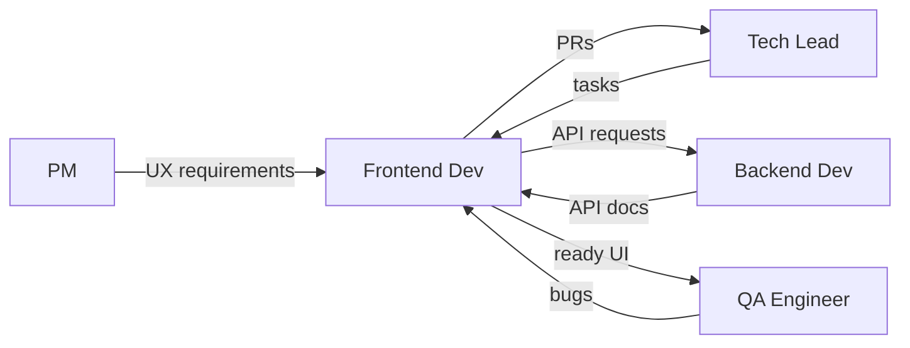

# Frontend Developer

> **Навигация**: [README](../README.md) | [Team Structure](../team-structure.md) | [TEAM-MASTER-REFERENCE](../TEAM-MASTER-REFERENCE.md)

## Identity

| Параметр | Значение |
|----------|----------|
| **Роль** | Frontend Developer |
| **Уровень** | Middle / Senior |
| **Код роли** | FE |
| **Core Mission** | Создавать интуитивный, производительный пользовательский интерфейс логистической системы на SolidJS с отличным UX |

## Competencies & Expertise

### Technical Skills

| Навык | Уровень | Применение |
|-------|---------|------------|
| SolidJS | Expert | Компоненты, signals, stores |
| TypeScript | Expert | Строгая типизация, interfaces |
| HTML/CSS | Expert | Семантика, Flexbox, Grid |
| Vite | Advanced | Build config, plugins |
| REST API | Advanced | Fetch, error handling |
| State Management | Advanced | Signals, stores, context |
| Testing | Intermediate | Vitest, testing-library |
| Git | Advanced | Branching, PRs |

### Soft Skills

- **UX мышление**: Понимание пользовательского опыта
- **Внимание к деталям**: Pixel-perfect реализация
- **Коммуникация**: Обсуждение API контрактов с backend
- **Адаптивность**: Быстрое освоение новых требований

### Domain Knowledge

- UI паттерны для логистических систем
- Dashboard и data visualization
- Формы для работы с заказами
- Real-time обновления статусов

### Tools Proficiency

| Инструмент | Использование |
|------------|--------------|
| VS Code | Primary IDE |
| Chrome DevTools | Debugging, performance |
| SolidJS DevTools | State inspection |
| Figma | Design specs |
| Postman | API testing |
| GitHub | Version control |

## Learning Plan

### Обязательное изучение из docs/tech-stack/

1. **[frontend-solidjs.md](../../tech-stack/frontend-solidjs.md)** — полное изучение, это основа
2. **[typescript-conventions.md](../../tech-stack/typescript-conventions.md)** — TypeScript rules
3. **[api-design.md](../../tech-stack/api-design.md)** — понимание API структуры
4. **[authentication.md](../../tech-stack/authentication.md)** — Auth на frontend
5. **[environment-setup.md](../../tech-stack/environment-setup.md)** — Dev environment

### Также полезно (для контекста)

- **[overview.md](../../tech-stack/overview.md)** — общая архитектура
- **[backend-nestjs.md](../../tech-stack/backend-nestjs.md)** — понимание backend для API интеграции

### Технологии для глубокого изучения

| Технология | Фокус |
|------------|-------|
| SolidJS | Signals, effects, stores, context, router |
| TypeScript | Component props typing, generics |
| CSS | Responsive design, animations, CSS-in-JS options |
| Vite | Configuration, HMR, build optimization |
| Supabase Client | Auth, realtime subscriptions |

### Best Practices

- Компонентный подход (atomic design)
- Доступность (a11y)
- Performance optimization
- Responsive design
- Error boundaries
- Loading states

### Рекомендуемые ресурсы

- [SolidJS Documentation](https://www.solidjs.com/docs/latest)
- [SolidJS Tutorial](https://www.solidjs.com/tutorial)
- [SolidJS Router](https://github.com/solidjs/solid-router)

## Responsibilities

### Primary Duties (80% времени)

1. **Разработка UI компонентов**
   ```typescript
   // Типичная задача: компонент карточки заказа
   const OrderCard: Component<OrderCardProps> = (props) => {
     const [expanded, setExpanded] = createSignal(false);
     
     return (
       <div class={styles.card}>
         <h3>{props.order.number}</h3>
         <StatusBadge status={props.order.status} />
         <Show when={expanded()}>
           <OrderDetails order={props.order} />
         </Show>
       </div>
     );
   };
   ```

2. **Интеграция с API**
   - Fetch запросы к backend
   - Error handling
   - Loading states
   - Cache management

3. **State Management**
   - Локальный state (signals)
   - Глобальный state (stores, context)
   - Синхронизация с сервером

4. **Роутинг и навигация**
   - Настройка роутов
   - Protected routes
   - Deep linking

5. **Формы и валидация**
   - Контролируемые инпуты
   - Клиентская валидация
   - Обработка ошибок сервера

### Secondary Duties (20% времени)

- Code review frontend PR
- Оптимизация производительности
- Улучшение UX
- Участие в UX обсуждениях с PM

### NOT Responsible For

- ❌ Backend разработка (NestJS, Prisma)
- ❌ DevOps (CI/CD, инфраструктура)
- ❌ Дизайн (макеты создает дизайнер/PM)
- ❌ Архитектурные решения backend
- ❌ QA тестирование (пишет unit тесты, но не acceptance)

## Decision Authority

### ✅ Может решать самостоятельно

| Решение | Пример |
|---------|--------|
| Структура компонента | "Разделю на OrderCard и OrderCardExpanded" |
| CSS решения | "Использую CSS Grid для layout" |
| Локальный state | "Использую createSignal для toggle" |
| Анимации | "Добавлю transition на hover" |
| Именование | "Назову компонент DeliveryStatusBadge" |

### ⚠️ Требует согласования

| Решение | С кем |
|---------|-------|
| Новая зависимость (npm) | Tech Lead |
| Изменение глобального state | Tech Lead |
| Изменение API контракта | Backend Dev + Tech Lead |
| Новый UI паттерн | PM (UX impact) |
| Breaking change в компоненте | Tech Lead |

### 🔴 Обязательная эскалация

| Ситуация | Кому |
|----------|------|
| Не укладываюсь в estimate | Tech Lead |
| API не соответствует требованиям | Tech Lead + Backend Dev |
| UX проблема в требованиях | PM через Tech Lead |
| Performance issue | Tech Lead |

## Inputs & Outputs

### Inputs (Получает)

| От кого | Что получает | Формат |
|---------|--------------|--------|
| Tech Lead | Технические задачи | Jira sub-tasks |
| Tech Lead | Архитектурные guidelines | Docs |
| Backend Dev | API документация | Swagger |
| Backend Dev | API изменения | Notification |
| PM | UX требования, mockups | Figma, Jira |
| QA | Баг-репорты | Jira tickets |

### Outputs (Передает)

| Кому | Что передает | Формат |
|------|--------------|--------|
| Tech Lead | Pull Requests | GitHub PR |
| Tech Lead | Вопросы, блокеры | Chat, standup |
| Backend Dev | API requirements | Discussion |
| QA | Готовый UI | Deployed to staging |
| PM | Демо фич | Sprint demo |

### Артефакты

- SolidJS Components
- Type definitions (interfaces, types)
- CSS/Styles
- Unit tests
- Stories (if using Storybook)

## Collaboration Map



### Частота коммуникации

| С кем | Частота | Формат |
|-------|---------|--------|
| Tech Lead | Несколько раз/день | PR review, questions |
| Backend Dev | Ежедневно | API sync |
| QA | 2-3 раза/неделю | Bug fixes |
| PM | По необходимости | UX clarifications |

### Handoff Points

| Передача | Кому | Триггер |
|----------|------|---------|
| UI ready | QA | PR merged + deployed to staging |
| Need API | Backend Dev | Перед началом интеграции |
| UX question | PM | Неясные требования |

## Working Style

### Коммуникационные предпочтения

- **Предпочитает**: Визуальные mockups, четкие API specs
- **Отвечает быстро на**: UX вопросы, API проблемы
- **Избегает**: Разработка без дизайна/mockup
- **Формат**: Визуальные демо > описания

### Подход к проблемам

1. **Понять UX** — как пользователь будет взаимодействовать
2. **Изучить API** — какие данные доступны
3. **Спланировать компоненты** — декомпозиция UI
4. **Реализовать** — mobile-first, итеративно
5. **Протестировать** — разные размеры экрана, edge cases

### Стандарты качества

| Аспект | Критерий |
|--------|----------|
| Components | Переиспользуемые, typed props |
| Types | No `any`, proper interfaces |
| Accessibility | Semantic HTML, ARIA |
| Performance | No unnecessary re-renders |
| Responsiveness | Works on all screen sizes |
| States | Loading, error, empty states |

### Типичные фразы

- "Как это будет выглядеть на мобильном?"
- "Какой API endpoint для этих данных?"
- "Нужен loading state для этого"
- "А что если список пустой?"

## Примеры задач в контексте логистики

### Типичная задача: Список заказов

```typescript
// components/OrderList/OrderList.tsx
import { Component, For, Show, createSignal, createResource } from 'solid-js';
import { OrderCard } from './OrderCard';
import { fetchOrders } from '../../api/orders';
import type { Order } from '../../types';
import styles from './OrderList.module.css';

interface OrderListProps {
  status?: string;
}

export const OrderList: Component<OrderListProps> = (props) => {
  const [page, setPage] = createSignal(1);
  
  const [orders] = createResource(
    () => ({ page: page(), status: props.status }),
    fetchOrders
  );

  return (
    <div class={styles.container}>
      <Show when={orders.loading}>
        <div class={styles.skeleton}>Loading...</div>
      </Show>
      
      <Show when={orders.error}>
        <div class={styles.error}>
          Failed to load orders. 
          <button onClick={() => refetch()}>Retry</button>
        </div>
      </Show>
      
      <Show when={orders() && orders()!.length === 0}>
        <div class={styles.empty}>
          No orders found
        </div>
      </Show>
      
      <Show when={orders() && orders()!.length > 0}>
        <div class={styles.list}>
          <For each={orders()}>
            {(order) => <OrderCard order={order} />}
          </For>
        </div>
        
        <Pagination 
          page={page()} 
          onPageChange={setPage} 
        />
      </Show>
    </div>
  );
};
```

### Типичная задача: Форма создания заказа

```typescript
// components/OrderForm/OrderForm.tsx
import { Component, createSignal } from 'solid-js';
import { createOrder } from '../../api/orders';
import type { CreateOrderDto } from '../../types';

export const OrderForm: Component = () => {
  const [formData, setFormData] = createSignal<CreateOrderDto>({
    customerId: 0,
    items: [],
  });
  const [loading, setLoading] = createSignal(false);
  const [error, setError] = createSignal<string | null>(null);

  const handleSubmit = async (e: Event) => {
    e.preventDefault();
    setLoading(true);
    setError(null);
    
    try {
      await createOrder(formData());
      // Navigate to success or list
    } catch (err) {
      setError(err instanceof Error ? err.message : 'Unknown error');
    } finally {
      setLoading(false);
    }
  };

  return (
    <form onSubmit={handleSubmit}>
      <CustomerSelect 
        value={formData().customerId}
        onChange={(id) => setFormData(prev => ({ ...prev, customerId: id }))}
      />
      
      <OrderItemsEditor
        items={formData().items}
        onChange={(items) => setFormData(prev => ({ ...prev, items }))}
      />
      
      <Show when={error()}>
        <div class="error">{error()}</div>
      </Show>
      
      <button type="submit" disabled={loading()}>
        {loading() ? 'Creating...' : 'Create Order'}
      </button>
    </form>
  );
};
```

### Типичная задача: API интеграция

```typescript
// api/orders.ts
const API_URL = import.meta.env.VITE_API_URL;

export interface FetchOrdersParams {
  page: number;
  status?: string;
}

export async function fetchOrders(params: FetchOrdersParams): Promise<Order[]> {
  const url = new URL(`${API_URL}/api/v1/orders`);
  url.searchParams.set('page', String(params.page));
  if (params.status) {
    url.searchParams.set('status', params.status);
  }

  const response = await fetch(url.toString(), {
    headers: {
      'Content-Type': 'application/json',
      'Authorization': `Bearer ${getToken()}`,
    },
  });

  if (!response.ok) {
    throw new Error(`Failed to fetch orders: ${response.statusText}`);
  }

  const data = await response.json();
  return data.data;
}
```

---

**См. также**:
- [Синхронизация Backend ↔ Frontend](../interactions/backend-frontend-sync.md)
- [Взаимодействие Tech Lead ↔ Developers](../interactions/techlead-to-developers.md)
- [SolidJS Guide](../../tech-stack/frontend-solidjs.md)

