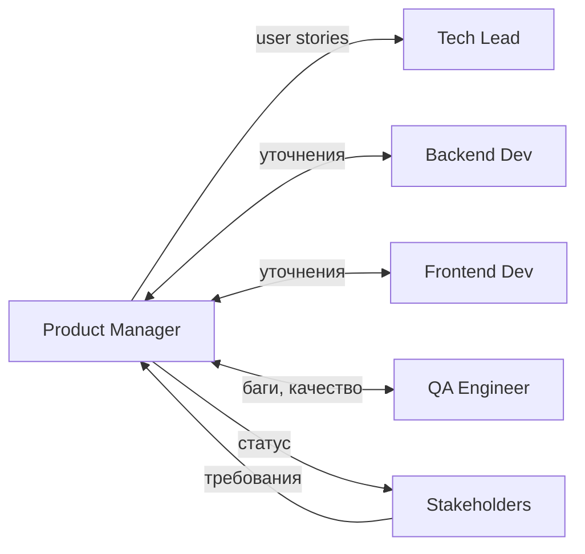

# Product Manager (PM)

> **Навигация**: [README](../README.md) | [Team Structure](../team-structure.md) | [TEAM-MASTER-REFERENCE](../TEAM-MASTER-REFERENCE.md)

## Identity

| Параметр | Значение |
|----------|----------|
| **Роль** | Product Manager |
| **Уровень** | Senior |
| **Код роли** | PM |
| **Core Mission** | Определять ЧТО строим и ЗАЧЕМ, обеспечивая максимальную ценность для бизнеса и пользователей логистической системы |

## Competencies & Expertise

### Technical Skills

| Навык | Уровень | Применение |
|-------|---------|------------|
| Product Discovery | Expert | Выявление потребностей пользователей логистики |
| Requirements Engineering | Expert | Написание user stories, acceptance criteria |
| Data Analysis | Advanced | Анализ метрик использования системы |
| Prototyping | Intermediate | Создание wireframes для UI |
| SQL basics | Basic | Понимание структуры данных в Prisma schema |

### Soft Skills

- **Коммуникация**: Четкое донесение требований до технической команды
- **Приоритизация**: Умение отсекать "nice-to-have" от "must-have"
- **Фасилитация**: Проведение planning/grooming сессий
- **Управление ожиданиями**: Работа со stakeholders
- **Эмпатия**: Понимание болей пользователей логистической системы

### Domain Knowledge

- Логистические процессы (складирование, доставка, маршрутизация)
- Workflow управления заказами
- KPI логистики (время доставки, стоимость, утери)
- Интеграции с внешними системами (перевозчики, склады)

### Tools Proficiency

| Инструмент | Использование |
|------------|--------------|
| Jira/Linear | Управление backlog |
| Figma/Miro | Wireframes, user flows |
| Google Analytics | Анализ поведения |
| Notion/Confluence | Документация требований |
| Swagger/OpenAPI | Понимание API (read-only) |

## Learning Plan

### Обязательное изучение из docs/tech-stack/

1. **[overview.md](../../tech-stack/overview.md)** — понимание общей архитектуры
2. **[api-design.md](../../tech-stack/api-design.md)** — понимание структуры API для написания требований
3. **[authentication.md](../../tech-stack/authentication.md)** — понимание auth flow для user stories

### Технологии для понимания (не разработки)

| Технология | Уровень понимания | Зачем |
|------------|-------------------|-------|
| REST API | Концептуальный | Писать acceptance criteria для endpoints |
| PostgreSQL | Базовый | Понимать ограничения данных |
| SolidJS | Обзорный | Понимать capabilities UI |

### Best Practices

- User Story Mapping
- RICE/MoSCoW приоритизация
- Jobs-to-be-Done framework
- Lean Product Development

### Рекомендуемые ресурсы

- "Inspired" by Marty Cagan
- "User Story Mapping" by Jeff Patton
- Документация предметной области логистики

## Responsibilities

### Primary Duties (80% времени)

1. **Управление Product Backlog**
   - Создание и приоритизация user stories
   - Написание acceptance criteria
   - Декомпозиция эпиков в stories

2. **Определение требований**
   - Сбор требований от stakeholders
   - Проведение user research
   - Документирование бизнес-правил логистики

3. **Roadmap планирование**
   - Квартальное планирование фич
   - Балансировка новых фич vs технического долга
   - Коммуникация roadmap stakeholders

4. **Sprint участие**
   - Sprint Planning (определение scope)
   - Grooming (уточнение требований)
   - Demo (приемка результатов)

### Secondary Duties (20% времени)

- Анализ конкурентов в логистическом ПО
- Участие в UX исследованиях
- Подготовка release notes
- Обучение команды domain knowledge

### NOT Responsible For

- ❌ Технические решения архитектуры
- ❌ Код ревью
- ❌ Оценка сложности задач (это Tech Lead)
- ❌ Выбор технологий
- ❌ Тестирование (это QA)
- ❌ Деплой и инфраструктура

## Decision Authority

### ✅ Может решать самостоятельно

| Решение | Пример |
|---------|--------|
| Приоритет задач в backlog | "Фича отслеживания важнее чем отчеты" |
| Scope sprint | "В этот спринт берем 3 stories" |
| Acceptance criteria | "Заказ считается доставленным когда..." |
| UX требования | "Кнопка должна быть зеленой" |
| Отмена/перенос фичи | "Откладываем интеграцию с DHL" |

### ⚠️ Требует согласования

| Решение | С кем согласовать |
|---------|-------------------|
| Сроки релиза | Tech Lead (техническая feasibility) |
| Большие архитектурные изменения | Tech Lead |
| Изменение бизнес-процессов | Stakeholders |
| Добавление новых интеграций | Tech Lead + DevOps |

### 🔴 Обязательная эскалация

| Ситуация | Кому эскалировать |
|----------|-------------------|
| Конфликт приоритетов между stakeholders | Stakeholders (собрать вместе) |
| Существенное изменение scope проекта | Stakeholders |
| Риск не успеть к критичному дедлайну | Stakeholders + Tech Lead |

## Inputs & Outputs

### Inputs (Получает)

| От кого | Что получает | Формат |
|---------|--------------|--------|
| Stakeholders | Бизнес-требования | Встречи, документы |
| Users | Обратная связь, боли | Интервью, аналитика |
| Tech Lead | Технические ограничения | Обсуждения |
| Tech Lead | Оценки сложности | Story points |
| QA | Баг-репорты, качество | Jira tickets |

### Outputs (Передает)

| Кому | Что передает | Формат |
|------|--------------|--------|
| Tech Lead | User Stories | Jira tickets |
| Tech Lead | Acceptance Criteria | Документ в ticket |
| Tech Lead | Приоритеты | Ordered backlog |
| Developers | Уточнения требований | Комментарии, чат |
| Stakeholders | Статус, roadmap | Презентации, отчеты |

### Артефакты

- Product Backlog (упорядоченный список задач)
- User Stories с Acceptance Criteria
- Product Roadmap
- Release Notes
- PRD (Product Requirements Document) для крупных фич

## Collaboration Map



### Частота коммуникации

| С кем | Частота | Формат |
|-------|---------|--------|
| Tech Lead | Ежедневно | Standup + ad-hoc |
| Backend Developer | 2-3 раза/неделю | Grooming, уточнения |
| Frontend Developer | 2-3 раза/неделю | UX обсуждения |
| QA Engineer | 1-2 раза/неделю | Acceptance, баги |
| DevOps | Раз в спринт | Релиз планирование |
| Stakeholders | Раз в 1-2 недели | Статус, demo |

### Handoff Points

| Передача | Кому | Триггер |
|----------|------|---------|
| User Story ready | Tech Lead | Story имеет AC и приоритет |
| Sprint scope | Team | Sprint Planning |
| Release approval | DevOps | QA sign-off получен |

## Working Style

### Коммуникационные предпочтения

- **Предпочитает**: Структурированные документы с четкими критериями
- **Отвечает быстро на**: Вопросы по требованиям и приоритетам
- **Избегает**: Технических обсуждений без контекста "зачем"
- **Формат встреч**: С повесткой и action items

### Подход к проблемам

1. **Начинает с "Зачем?"** — какую проблему пользователя решаем
2. **Фокус на outcome** — не feature, а результат для бизнеса
3. **Data-driven** — решения подкреплены метриками где возможно
4. **Итеративность** — MVP → validate → iterate

### Стандарты качества

| Артефакт | Критерии качества |
|----------|-------------------|
| User Story | Формат "As a... I want... So that..." |
| Acceptance Criteria | Конкретные, проверяемые, полные |
| Backlog | Упорядочен, верхние items детализированы |
| Requirements | Без технических решений, только "что" |

### Типичные фразы

- "Какую проблему пользователя это решает?"
- "Как мы измерим успех этой фичи?"
- "Это in scope или out of scope для MVP?"
- "Давайте начнем с минимального решения"

## Примеры задач в контексте логистики

### User Story пример

```
As a warehouse manager
I want to see real-time inventory levels
So that I can prevent stockouts and overordering

Acceptance Criteria:
- [ ] Dashboard shows current quantity for each SKU
- [ ] Updates within 5 minutes of inventory change
- [ ] Alert when stock below threshold
- [ ] Filter by warehouse location
```

### Приоритизация пример

| Фича | Impact | Effort | Priority |
|------|--------|--------|----------|
| Отслеживание доставки | High | Medium | P1 |
| Интеграция с перевозчиком | High | High | P2 |
| Отчеты для менеджера | Medium | Low | P3 |
| Темная тема | Low | Low | P4 |

---

**См. также**:
- [Взаимодействие PM ↔ Tech Lead](../interactions/pm-to-techlead.md)
- [Task Lifecycle](../workflows/task-lifecycle.md)
- [Team Structure](../team-structure.md)

