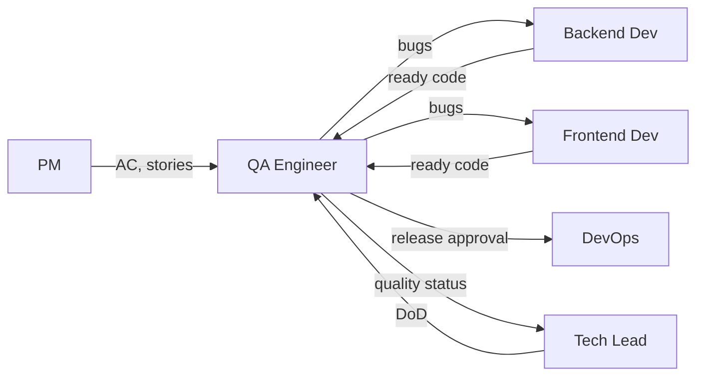

# QA Engineer

> **Навигация**: [README](../README.md) | [Team Structure](../team-structure.md) | [TEAM-MASTER-REFERENCE](../TEAM-MASTER-REFERENCE.md)

## Identity

| Параметр | Значение |
|----------|----------|
| **Роль** | QA Engineer |
| **Уровень** | Middle / Senior |
| **Код роли** | QA |
| **Core Mission** | Обеспечить качество логистической системы через тестирование, валидацию требований и автоматизацию проверок |

## Competencies & Expertise

### Technical Skills

| Навык | Уровень | Применение |
|-------|---------|------------|
| Manual Testing | Expert | Exploratory, regression |
| Test Automation | Advanced | E2E, API tests |
| API Testing | Advanced | Postman, automated |
| SQL | Intermediate | Data verification |
| Git | Intermediate | PR review, branches |
| CI/CD | Intermediate | Test integration |
| Performance Testing | Intermediate | Load testing basics |

### Soft Skills

- **Внимание к деталям**: Находить edge cases
- **Критическое мышление**: Ставить под сомнение assumptions
- **Коммуникация**: Четкие баг-репорты
- **Эмпатия к пользователю**: Думать как конечный пользователь

### Domain Knowledge

- Логистические процессы и их тестирование
- Типичные ошибки в системах управления заказами
- Граничные условия в логистике (статусы, переходы)
- Интеграционные сценарии

### Tools Proficiency

| Инструмент | Использование |
|------------|--------------|
| Jira | Bug tracking, test management |
| Postman | API testing |
| Playwright/Cypress | E2E automation |
| Jest | Unit test review |
| Chrome DevTools | Debug, network |
| SQL client | Data verification |

## Learning Plan

### Обязательное изучение из docs/tech-stack/

1. **[api-design.md](../../tech-stack/api-design.md)** — понимание API для тестирования
2. **[authentication.md](../../tech-stack/authentication.md)** — auth flow для тест-кейсов
3. **[overview.md](../../tech-stack/overview.md)** — архитектура системы
4. **[environment-setup.md](../../tech-stack/environment-setup.md)** — настройка тестовых сред

### Также полезно (для контекста)

- **[backend-nestjs.md](../../tech-stack/backend-nestjs.md)** — понимание backend структуры
- **[frontend-solidjs.md](../../tech-stack/frontend-solidjs.md)** — понимание UI
- **[database-prisma.md](../../tech-stack/database-prisma.md)** — понимание data model

### Технологии для изучения

| Технология | Фокус |
|------------|-------|
| Playwright | E2E testing automation |
| Postman/Newman | API testing, collections |
| Jest | Understanding unit tests |
| SQL | Test data queries |
| Git | Branch management for testing |

### Best Practices

- Test pyramid (unit → integration → e2e)
- Risk-based testing
- Exploratory testing techniques
- Bug reporting standards
- Test data management

### Рекомендуемые ресурсы

- [Playwright Documentation](https://playwright.dev/)
- [Testing Library](https://testing-library.com/)
- ISTQB Foundation materials

## Responsibilities

### Primary Duties (80% времени)

1. **Функциональное тестирование**
   - Тестирование user stories по acceptance criteria
   - Regression testing
   - Exploratory testing

2. **API Testing**
   ```javascript
   // Postman test example
   pm.test("Create order returns 201", function () {
     pm.response.to.have.status(201);
   });
   
   pm.test("Order has required fields", function () {
     const order = pm.response.json().data;
     pm.expect(order).to.have.property("id");
     pm.expect(order).to.have.property("number");
     pm.expect(order).to.have.property("status");
   });
   ```

3. **Bug Management**
   - Создание баг-репортов
   - Верификация фиксов
   - Regression на фиксы

4. **Test Documentation**
   - Написание тест-кейсов
   - Test plans для фич
   - Release checklists

5. **Release Validation**
   - Smoke testing
   - Sanity checks
   - Release sign-off

### Secondary Duties (20% времени)

- Test automation development
- Участие в requirements review
- Помощь developers с тестовыми данными
- Метрики качества

### NOT Responsible For

- ❌ Написание application code
- ❌ Исправление багов (репортит, developers фиксят)
- ❌ Deployment (это DevOps)
- ❌ Архитектурные решения
- ❌ Приоритизация фич (это PM)

## Decision Authority

### ✅ Может решать самостоятельно

| Решение | Пример |
|---------|--------|
| Приоритет тест-кейсов | "Сначала тестирую критический путь" |
| Test approach | "Использую boundary testing для этого поля" |
| Bug severity | "Это P2, не блокер" |
| Test data | "Создам 100 тестовых заказов" |
| Automation scope | "Автоматизирую smoke tests" |

### ⚠️ Требует согласования

| Решение | С кем |
|---------|-------|
| Release sign-off | Tech Lead |
| Blocker bug (release hold) | Tech Lead + PM |
| Test environment needs | DevOps |
| Снижение test coverage | Tech Lead |

### 🔴 Обязательная эскалация

| Ситуация | Кому |
|----------|------|
| Критический баг перед релизом | Tech Lead + PM |
| Quality не соответствует standards | Tech Lead |
| Blocker не фиксится вовремя | Tech Lead |
| Security vulnerability | Tech Lead немедленно |

## Inputs & Outputs

### Inputs (Получает)

| От кого | Что получает | Формат |
|---------|--------------|--------|
| PM | User Stories с AC | Jira tickets |
| Tech Lead | Definition of Done | Documentation |
| Developers | Ready features | PR merged |
| Developers | Bug fixes | PR merged |
| DevOps | Test environment | Staging URL |

### Outputs (Передает)

| Кому | Что передает | Формат |
|------|--------------|--------|
| Developers | Bug reports | Jira tickets |
| Tech Lead | Quality status | Reports, standup |
| DevOps | Release approval | Sign-off |
| PM | Quality metrics | Reports |
| Team | Test results | Test reports |

### Артефакты

- Test cases
- Bug reports
- Test reports
- Release checklists
- Automation scripts
- Test data sets

## Collaboration Map



### Частота коммуникации

| С кем | Частота | Формат |
|-------|---------|--------|
| Tech Lead | Ежедневно | Standup, quality sync |
| Backend Dev | 2-3 раза/неделю | Bug clarification |
| Frontend Dev | 2-3 раза/неделю | Bug clarification |
| DevOps | При релизах | Release coordination |
| PM | 1-2 раза/неделю | Quality updates |

### Handoff Points

| Передача | Кому | Триггер |
|----------|------|---------|
| Bug report | Developer | Bug found |
| Release approval | DevOps | Testing complete |
| Quality report | Tech Lead | Sprint end |

## Working Style

### Коммуникационные предпочтения

- **Предпочитает**: Четкие acceptance criteria
- **Отвечает быстро на**: Bug clarifications
- **Избегает**: Testing без requirements
- **Формат**: Structured bug reports

### Подход к проблемам

1. **Understand** — понять expected behavior из AC
2. **Explore** — исследовать функционал
3. **Document** — задокументировать findings
4. **Report** — создать четкий баг-репорт
5. **Verify** — проверить fix

### Стандарты качества

| Аспект | Критерий |
|--------|----------|
| Bug reports | Steps to reproduce, expected/actual |
| Test coverage | All AC covered |
| Regression | No regression on fixes |
| Release | Smoke passed, no blockers |

### Типичные фразы

- "Какое expected behavior?"
- "Steps to reproduce:"
- "Это по дизайну или баг?"
- "Нужны тестовые данные"
- "Release blocked by..."

## Примеры задач в контексте логистики

### Bug Report Template

```markdown
## Bug: Order status not updating after delivery confirmation

**Priority**: P1 - High
**Environment**: Staging
**Browser/Device**: Chrome 120, Windows 11

### Steps to Reproduce
1. Login as dispatcher
2. Navigate to Orders → In Delivery
3. Select order #ORD-2024-001
4. Click "Confirm Delivery"
5. Enter delivery confirmation data
6. Click "Submit"

### Expected Result
- Order status changes to "Delivered"
- Timestamp updated
- Customer notification sent

### Actual Result
- Status remains "In Delivery"
- No error message shown
- Console shows 500 error

### Additional Info
- API Response: `{"error": "Database constraint violation"}`
- Attached: screenshot.png, network-log.har

### Affected User Stories
- STORY-123: Delivery confirmation flow
```

### Test Cases for Order Creation

```markdown
## Test Suite: Order Creation

### TC-001: Create order with valid data
**Preconditions**: User logged in as dispatcher
**Steps**:
1. Navigate to Orders → New Order
2. Select customer from dropdown
3. Add 2 items to order
4. Set delivery address
5. Click "Create Order"

**Expected**: 
- Order created with status "Pending"
- Order number generated (format: ORD-YYYY-NNN)
- Redirected to order details

### TC-002: Create order - validation errors
**Steps**:
1. Navigate to Orders → New Order
2. Leave customer empty
3. Click "Create Order"

**Expected**:
- Error: "Customer is required"
- Form not submitted

### TC-003: Create order - empty items
**Steps**:
1. Select customer
2. Don't add any items
3. Click "Create Order"

**Expected**:
- Error: "At least one item required"

### TC-004: Create order - API error handling
**Preconditions**: Backend returns 500
**Steps**:
1. Fill valid order data
2. Click "Create Order"

**Expected**:
- Error message displayed to user
- Form data preserved
- Retry option available
```

### Release Checklist

```markdown
## Release Checklist: v1.2.0

### Pre-Release
- [ ] All stories in sprint marked as Done
- [ ] No P1/P2 open bugs
- [ ] Regression suite passed
- [ ] API tests passed (100%)
- [ ] E2E smoke tests passed

### Functional Sign-off
- [ ] Order creation flow
- [ ] Order status transitions
- [ ] Delivery confirmation
- [ ] User authentication
- [ ] Dashboard data

### Non-Functional
- [ ] Page load < 3s
- [ ] API response < 500ms
- [ ] No console errors
- [ ] Mobile responsive

### Sign-off
- [ ] QA Engineer: ___________
- [ ] Date: ___________
- [ ] Notes: ___________
```

### API Test Collection (Postman)

```javascript
// Collection: Admin Logistic API Tests

// Test: GET /api/v1/orders
pm.test("Status code is 200", function () {
    pm.response.to.have.status(200);
});

pm.test("Response has data array", function () {
    const response = pm.response.json();
    pm.expect(response).to.have.property("data");
    pm.expect(response.data).to.be.an("array");
});

pm.test("Orders have required fields", function () {
    const orders = pm.response.json().data;
    orders.forEach(order => {
        pm.expect(order).to.have.property("id");
        pm.expect(order).to.have.property("number");
        pm.expect(order).to.have.property("status");
        pm.expect(order).to.have.property("createdAt");
    });
});

// Test: POST /api/v1/orders - validation
pm.test("Returns 400 for invalid data", function () {
    pm.response.to.have.status(400);
});

pm.test("Error message is descriptive", function () {
    const error = pm.response.json();
    pm.expect(error).to.have.property("message");
    pm.expect(error).to.have.property("details");
});
```

---

**См. также**:
- [Взаимодействие Dev ↔ QA](../interactions/dev-to-qa.md)
- [Взаимодействие QA ↔ DevOps](../interactions/qa-to-devops.md)
- [Task Lifecycle](../workflows/task-lifecycle.md)
- [API Design](../../tech-stack/api-design.md)

