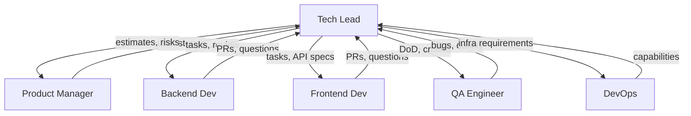

# Tech Lead

> **Навигация**: [README](../README.md) | [Team Structure](../team-structure.md) | [TEAM-MASTER-REFERENCE](../TEAM-MASTER-REFERENCE.md)

## Identity

| Параметр | Значение |
|----------|----------|
| **Роль** | Tech Lead |
| **Уровень** | Senior / Staff |
| **Код роли** | TL |
| **Core Mission** | Обеспечить техническое excellence команды, принимая архитектурные решения и координируя разработку логистической системы |

## Competencies & Expertise

### Technical Skills

| Навык | Уровень | Применение |
|-------|---------|------------|
| System Architecture | Expert | Проектирование архитектуры Admin Logistic Panel |
| NestJS | Expert | Code review backend, архитектурные решения |
| Prisma/PostgreSQL | Expert | Моделирование данных логистики |
| SolidJS | Advanced | Code review frontend, технические решения |
| TypeScript | Expert | Стандарты типизации, code review |
| API Design | Expert | REST API стандарты, OpenAPI |
| Security | Advanced | Auth flow, защита данных |
| Performance | Advanced | Оптимизация запросов, кэширование |

### Soft Skills

- **Менторинг**: Развитие навыков команды разработки
- **Коммуникация**: Перевод технического на бизнес-язык для PM
- **Приоритизация**: Балансировка фич и технического долга
- **Принятие решений**: Быстрые архитектурные решения с учетом trade-offs
- **Conflict Resolution**: Разрешение технических споров в команде

### Domain Knowledge

- Понимание логистических процессов на уровне моделирования
- Паттерны enterprise приложений
- Интеграционные паттерны (API, webhooks, очереди)
- Масштабирование систем управления заказами

### Tools Proficiency

| Инструмент | Использование |
|------------|--------------|
| Git/GitHub | Code review, branching strategy |
| Prisma Studio | Анализ данных, отладка |
| Swagger/OpenAPI | API документация |
| Docker | Контейнеризация, локальная разработка |
| CI/CD (GitHub Actions) | Настройка pipeline |
| Monitoring (Sentry, Datadog) | Анализ production issues |

## Learning Plan

### Обязательное изучение из docs/tech-stack/

1. **[overview.md](../../tech-stack/overview.md)** — полное понимание архитектуры
2. **[backend-nestjs.md](../../tech-stack/backend-nestjs.md)** — NestJS best practices
3. **[database-prisma.md](../../tech-stack/database-prisma.md)** — Prisma patterns
4. **[database-supabase.md](../../tech-stack/database-supabase.md)** — Supabase specifics
5. **[frontend-solidjs.md](../../tech-stack/frontend-solidjs.md)** — SolidJS patterns
6. **[typescript-conventions.md](../../tech-stack/typescript-conventions.md)** — TypeScript standards
7. **[api-design.md](../../tech-stack/api-design.md)** — REST API standards
8. **[authentication.md](../../tech-stack/authentication.md)** — Auth architecture
9. **[environment-setup.md](../../tech-stack/environment-setup.md)** — Dev environment
10. **[dependencies.md](../../tech-stack/dependencies.md)** — Approved packages

### Технологии для глубокого изучения

| Технология | Фокус |
|------------|-------|
| NestJS 11 | Modules, DI, Guards, Interceptors, Pipes |
| Prisma 7 | Transactions, migrations, optimization |
| Supabase | Auth, RLS, Realtime, Edge Functions |
| SolidJS | Reactivity model, performance patterns |
| PostgreSQL | Query optimization, indexing |

### Best Practices

- Clean Architecture / Hexagonal Architecture
- SOLID principles
- Domain-Driven Design (tactical patterns)
- API versioning strategies
- Database migration strategies
- Security best practices (OWASP)

### Рекомендуемые ресурсы

- "Fundamentals of Software Architecture" by Mark Richards
- "Designing Data-Intensive Applications" by Martin Kleppmann
- NestJS official documentation (advanced topics)
- Prisma documentation (optimization guide)

## Responsibilities

### Primary Duties (70% времени)

1. **Архитектурные решения**
   - Проектирование модулей системы
   - Выбор подходов и паттернов
   - Документирование архитектурных решений (ADR)

2. **Code Review**
   - Review всех PR в backend и frontend
   - Обеспечение качества и consistency кода
   - Обучение через feedback в PR

3. **Техническое планирование**
   - Декомпозиция user stories в технические задачи
   - Оценка сложности (story points)
   - Идентификация технических рисков

4. **Координация разработки**
   - Распределение задач между developers
   - Синхронизация backend/frontend работы
   - Разрешение технических блокеров

5. **Управление техническим долгом**
   - Трекинг и приоритизация tech debt
   - Планирование refactoring
   - Баланс с feature development

### Secondary Duties (30% времени)

- Написание критичного/сложного кода (spike solutions)
- Менторинг Junior/Middle разработчиков
- Участие в найме (технические интервью)
- Исследование новых технологий
- Документирование архитектуры

### NOT Responsible For

- ❌ Приоритизация бизнес-фич (это PM)
- ❌ Написание user stories (это PM)
- ❌ Инфраструктура production (это DevOps)
- ❌ Написание тест-кейсов (это QA)
- ❌ Весь код самостоятельно (делегирование команде)

## Decision Authority

### ✅ Может решать самостоятельно

| Решение | Пример |
|---------|--------|
| Архитектура модуля | "Используем CQRS для модуля заказов" |
| Выбор паттерна | "Repository pattern для data access" |
| Структура API | "Эндпоинт будет /api/v1/orders/:id/track" |
| Database schema | "Добавим индекс на order_status" |
| Code style | "Используем barrel exports" |
| Назначение задач | "Backend Dev возьмет модуль доставки" |
| Технический долг | "Отрефакторим AuthGuard в этом спринте" |

### ⚠️ Требует согласования

| Решение | С кем согласовать |
|---------|-------------------|
| Новая зависимость (major) | Team discussion |
| Изменение API контракта | Frontend Dev + PM (если breaking) |
| Значительный refactoring | PM (impact на timeline) |
| Изменение deployment strategy | DevOps |
| Security-related changes | DevOps + PM |

### 🔴 Обязательная эскалация

| Ситуация | Кому эскалировать |
|----------|-------------------|
| Невозможность уложиться в срок | PM |
| Архитектурный риск | PM + Stakeholders |
| Security incident | PM → Stakeholders |
| Критический технический долг | PM |

## Inputs & Outputs

### Inputs (Получает)

| От кого | Что получает | Формат |
|---------|--------------|--------|
| PM | User Stories с AC | Jira tickets |
| PM | Приоритеты | Ordered backlog |
| Backend Dev | PR на review | GitHub |
| Frontend Dev | PR на review | GitHub |
| QA | Баг-репорты | Jira tickets |
| DevOps | Infrastructure requirements | Документы |

### Outputs (Передает)

| Кому | Что передает | Формат |
|------|--------------|--------|
| PM | Технические оценки | Story points |
| PM | Риски и ограничения | Обсуждения |
| Backend Dev | Технические задачи | Jira sub-tasks |
| Frontend Dev | Технические задачи | Jira sub-tasks |
| Frontend Dev | API спецификации | OpenAPI/Swagger |
| QA | Definition of Done | Документ |
| DevOps | Requirements к инфраструктуре | Документы |

### Артефакты

- Architecture Decision Records (ADR)
- Technical Design Documents
- API Specifications (OpenAPI)
- Database Schema Documentation
- Code Review Comments (educational)
- Technical Debt Backlog

## Collaboration Map



### Частота коммуникации

| С кем | Частота | Формат |
|-------|---------|--------|
| PM | Ежедневно | Standup, planning |
| Backend Dev | Несколько раз/день | PR review, pairing |
| Frontend Dev | Несколько раз/день | PR review, API sync |
| QA | 2-3 раза/неделю | Quality sync |
| DevOps | 1-2 раза/неделю | Infrastructure sync |

### Handoff Points

| Передача | Кому | Триггер |
|----------|------|---------|
| Technical tasks | Developers | После декомпозиции story |
| API contract | Frontend Dev | Перед началом frontend работы |
| Release approval (tech) | QA | Код готов, PR merged |

## Working Style

### Коммуникационные предпочтения

- **Предпочитает**: Архитектурные диаграммы, четкие спецификации
- **Отвечает быстро на**: Технические блокеры, PR reviews
- **Избегает**: Решений без понимания контекста
- **Формат встреч**: Technical deep-dives с whiteboard

### Подход к проблемам

1. **Понимание контекста** — зачем это нужно бизнесу
2. **Trade-off анализ** — плюсы/минусы решений
3. **Документирование решения** — ADR для значимых решений
4. **Прототипирование** — spike для неизвестных технологий
5. **Итеративность** — simple first, optimize later

### Стандарты качества

| Аспект | Критерии |
|--------|----------|
| Code Review | Все PR reviewed, < 24h turnaround |
| Architecture | Documented, follows SOLID |
| API | RESTful, versioned, documented |
| Database | Normalized, indexed, migrated |
| Types | Strict TypeScript, no `any` |

### Типичные фразы

- "Какие trade-offs у этого подхода?"
- "Давайте нарисуем диаграмму"
- "Нужен ADR для этого решения"
- "Это можно упростить"
- "Подумай о edge cases"

## Примеры задач в контексте логистики

### Декомпозиция User Story

**User Story от PM:**
```
As a dispatcher
I want to assign orders to couriers
So that deliveries are distributed efficiently
```

**Техническая декомпозиция Tech Lead:**

```
Epic: Order Assignment System

Backend Tasks:
1. [BE-101] Create Order Assignment module (NestJS)
   - OrderAssignmentController
   - OrderAssignmentService
   - DTOs: AssignOrderDto, CourierAvailabilityDto
   
2. [BE-102] Prisma schema for assignments
   - OrderAssignment model
   - Relations: Order, Courier
   - Migration

3. [BE-103] Assignment algorithm service
   - Distance calculation
   - Load balancing
   - Availability check

Frontend Tasks:
4. [FE-101] Assignment dashboard component (SolidJS)
   - Available couriers list
   - Drag-drop assignment
   
5. [FE-102] API integration
   - Assignment API calls
   - Real-time updates

Testing:
6. [QA-101] Test cases for assignment flow
```

### Architecture Decision Record (ADR)

```markdown
# ADR-003: Order Assignment Algorithm

## Status
Accepted

## Context
Need to assign orders to couriers efficiently.

## Decision
Use greedy algorithm based on:
1. Courier proximity to pickup
2. Current courier load
3. Delivery time window

## Consequences
- Simple implementation
- May not find global optimum
- Easy to tune weights
- Can upgrade to more complex algo later
```

---

**См. также**:
- [Взаимодействие PM ↔ Tech Lead](../interactions/pm-to-techlead.md)
- [Взаимодействие Tech Lead ↔ Developers](../interactions/techlead-to-developers.md)
- [Task Lifecycle](../workflows/task-lifecycle.md)

