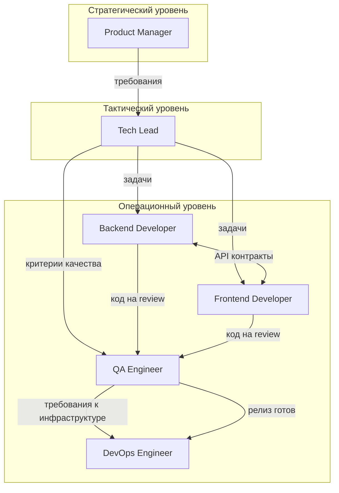
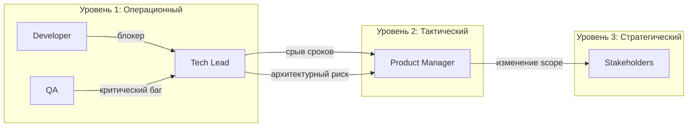

# Team Structure — Организационная структура команды

> **Навигация**: [README](./README.md) | [TEAM-MASTER-REFERENCE](./TEAM-MASTER-REFERENCE.md) | [Персоны](./personas/)

## Организационная иерархия

## Линии подчинения

| Роль | Отчитывается перед | Координируется с |
|------|-------------------|------------------|
| Product Manager | Stakeholders (внешние) | Tech Lead |
| Tech Lead | Product Manager | Вся команда |
| Backend Developer | Tech Lead | Frontend Developer, QA |
| Frontend Developer | Tech Lead | Backend Developer, QA |
| QA Engineer | Tech Lead | Developers, DevOps |
| DevOps Engineer | Tech Lead | QA, Developers |

## Уровни принятия решений

### 🟢 Автономные решения (не требуют согласования)

| Роль | Может решать самостоятельно |
|------|----------------------------|
| Backend Developer | Выбор паттерна в рамках архитектуры, именование переменных, структура модуля |
| Frontend Developer | Структура компонента, локальный state management, CSS решения |
| QA Engineer | Приоритет тест-кейсов, инструменты тестирования |
| DevOps Engineer | Оптимизация pipeline, настройка мониторинга |

### 🟡 Решения требующие согласования

| Решение | Кто согласует |
|---------|--------------|
| Новый API endpoint | Tech Lead |
| Изменение схемы БД | Tech Lead + Backend Developer |
| Новая зависимость (npm package) | Tech Lead |
| Изменение UI/UX | Product Manager |
| Изменение deployment strategy | Tech Lead + DevOps |

### 🔴 Эскалация обязательна

| Ситуация | Эскалировать к |
|----------|---------------|
| Изменение архитектуры | Tech Lead → PM (если влияет на сроки) |
| Срыв дедлайна | Tech Lead → PM |
| Критический баг в production | DevOps → Tech Lead → PM |
| Конфликт требований | PM (финальное решение) |
| Безопасность/утечка данных | Tech Lead → PM → Stakeholders |

## Каналы коммуникации

### Синхронная коммуникация

| Тип | Участники | Частота | Цель |
|-----|-----------|---------|------|
| Daily Standup | Вся команда | Ежедневно, 15 мин | Синхронизация, блокеры |
| Sprint Planning | PM, Tech Lead, Developers | Раз в спринт | Планирование работы |
| Tech Review | Tech Lead, Developers | По необходимости | Архитектурные решения |
| Demo | Вся команда + PM | Конец спринта | Демонстрация результатов |

### Асинхронная коммуникация

| Канал | Использование |
|-------|--------------|
| Task Tracker (Jira/Linear) | Задачи, статусы, комментарии |
| Pull Requests | Code review, технические обсуждения |
| Документация | Архитектурные решения, API спецификации |
| Chat (Slack/Teams) | Быстрые вопросы, уведомления |

## Матрица ответственности (RACI)

| Активность | PM | Tech Lead | Backend | Frontend | QA | DevOps |
|------------|:--:|:---------:|:-------:|:--------:|:--:|:------:|
| Определение требований | **R** | C | I | I | I | I |
| Архитектурные решения | I | **R** | C | C | I | C |
| Разработка API | I | A | **R** | C | I | I |
| Разработка UI | I | A | C | **R** | I | I |
| Code Review | I | **R** | C | C | C | I |
| Тестирование | I | I | C | C | **R** | I |
| Деплой | I | A | I | I | C | **R** |
| Мониторинг production | I | C | I | I | I | **R** |

**Легенда**: R = Responsible (исполняет), A = Accountable (отвечает), C = Consulted (консультирует), I = Informed (информируется)

## Зоны пересечения ответственности

### Backend ↔ Frontend
- **Точка пересечения**: API контракты
- **Артефакт**: OpenAPI/Swagger спецификация
- **Синхронизация**: При изменении API — обязательное уведомление
- **См.**: [backend-frontend-sync.md](./interactions/backend-frontend-sync.md)

### Developers ↔ QA
- **Точка пересечения**: Definition of Done
- **Артефакт**: Тест-кейсы, acceptance criteria
- **Синхронизация**: QA участвует в планировании
- **См.**: [dev-to-qa.md](./interactions/dev-to-qa.md)

### QA ↔ DevOps
- **Точка пересечения**: Релиз
- **Артефакт**: Release checklist, test reports
- **Синхронизация**: Релиз только после QA approval
- **См.**: [qa-to-devops.md](./interactions/qa-to-devops.md)

## Правила эскалации

### Время реакции на эскалацию

| Приоритет | Время реакции | Пример |
|-----------|--------------|--------|
| Critical | 1 час | Production down, утечка данных |
| High | 4 часа | Блокер для команды, срыв дедлайна |
| Medium | 24 часа | Технический долг, оптимизация |
| Low | 1 спринт | Nice-to-have улучшения |

## Онбординг новых членов команды

1. **День 1**: Чтение [TEAM-MASTER-REFERENCE.md](./TEAM-MASTER-REFERENCE.md)
2. **День 1-2**: Изучение персоны своей роли в `/personas/`
3. **День 2-3**: Изучение Learning Plan из персоны
4. **День 3-5**: Изучение взаимодействий в `/interactions/`
5. **Неделя 1**: Первая задача под менторством Tech Lead

---

**См. также**: 
- [Персоны](./personas/) — детальные профили ролей
- [Workflows](./workflows/) — рабочие процессы
- [Interactions](./interactions/) — взаимодействия между ролями

