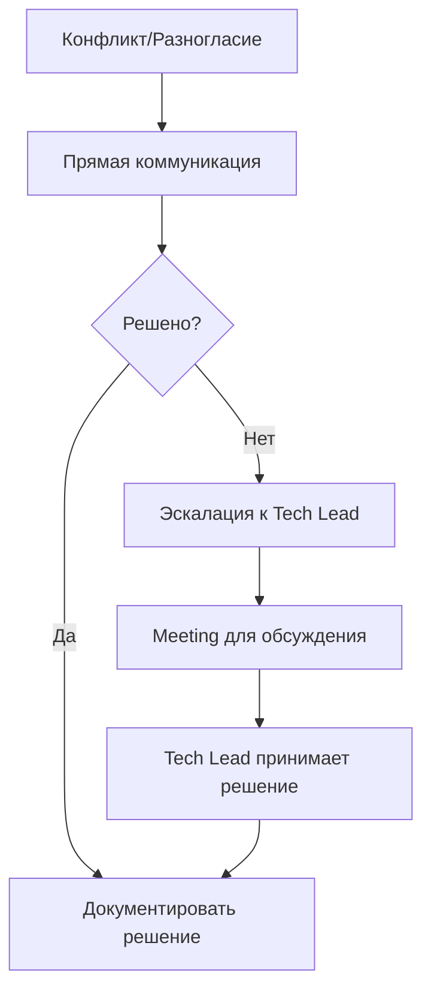

# Communication Protocols — Протоколы коммуникации

> **Навигация**: [README](../README.md) | [Team Structure](../team-structure.md) | [TEAM-MASTER-REFERENCE](../TEAM-MASTER-REFERENCE.md)

## Обзор

Этот документ определяет как, когда и через какие каналы члены команды должны общаться.

## Каналы коммуникации

### Матрица каналов

| Канал | Когда использовать | Время ответа |
|-------|-------------------|--------------|
| **Slack/Teams** | Быстрые вопросы, уведомления | < 2 часа |
| **Jira Comments** | Обсуждение задач, требования | < 24 часа |
| **Pull Request** | Code review, технические вопросы | < 24 часа |
| **Email** | Формальная коммуникация, внешние | < 24 часа |
| **Video Call** | Сложные обсуждения, решения | По расписанию |
| **Daily Standup** | Статус, блокеры | Ежедневно |

### Slack/Teams Structure

```
#admin-logistic-general    - Общие обсуждения
#admin-logistic-dev        - Технические вопросы
#admin-logistic-deployments - CI/CD, релизы
#admin-logistic-bugs       - Баг-репорты, инциденты
#admin-logistic-standup    - Async standup updates
```

## Регулярные встречи

### Daily Standup

| Параметр | Значение |
|----------|----------|
| **Частота** | Ежедневно, 10:00 |
| **Длительность** | 15 минут max |
| **Участники** | Вся команда |
| **Формат** | Sync или async |

**Структура:**
```markdown
## [Имя] — Daily Update

### Вчера
- Завершил BE-201 Order Tracking module
- Начал BE-202 API endpoints

### Сегодня
- Продолжу BE-202
- Code review FE-201

### Blockers
- Нет / Жду API документацию от [кого]
```

**Async standup (если timezone issues):**
- Постить в #admin-logistic-standup до 10:00
- Использовать thread для обсуждения блокеров

### Sprint Planning

| Параметр | Значение |
|----------|----------|
| **Частота** | Раз в 2 недели |
| **Длительность** | 1-2 часа |
| **Участники** | PM, Tech Lead, Developers, QA |
| **Ведущий** | PM |

**Agenda:**
```markdown
1. Sprint Review (10 min)
   - Что было сделано
   - Что не успели и почему

2. Velocity Check (5 min)
   - Текущий velocity
   - Capacity на следующий спринт

3. Backlog Review (30 min)
   - PM представляет prioritized stories
   - Tech Lead уточняет технические детали

4. Story Selection (30 min)
   - Команда выбирает stories
   - Tech Lead декомпозирует на tasks

5. Commitment (10 min)
   - Финальный sprint backlog
   - Sprint goal
```

### Grooming/Refinement

| Параметр | Значение |
|----------|----------|
| **Частота** | Раз в неделю |
| **Длительность** | 30-60 минут |
| **Участники** | PM, Tech Lead, иногда Developers |
| **Ведущий** | PM |

**Цель:** Подготовить stories для следующего Sprint Planning

**Agenda:**
```markdown
1. Review upcoming stories
2. Clarify requirements
3. Add/refine Acceptance Criteria
4. Estimate complexity (planning poker опционально)
5. Identify dependencies
```

### Sprint Demo

| Параметр | Значение |
|----------|----------|
| **Частота** | Конец спринта |
| **Длительность** | 30-60 минут |
| **Участники** | Вся команда + PM |
| **Ведущий** | Tech Lead |

**Формат:**
```markdown
1. Sprint Goal Reminder
2. Demo каждой завершенной story
   - Developer демонстрирует функционал
   - PM подтверждает соответствие требованиям
3. Q&A
4. Feedback collection
```

### Retro

| Параметр | Значение |
|----------|----------|
| **Частота** | Конец спринта |
| **Длительность** | 45 минут |
| **Участники** | Вся команда |
| **Ведущий** | Rotating |

**Формат (Start/Stop/Continue):**
```markdown
## Start (Что начать делать)
- Более детальные AC

## Stop (Что перестать делать)
- Large PRs без декомпозиции

## Continue (Что продолжать)
- Quick code reviews
- Daily async updates
```

## Communication Templates

### Asking for Help

```markdown
## Request: [Краткое описание]

**Context**: 
Работаю над [задача], столкнулся с [проблема].

**What I've Tried**:
1. Попробовал X — результат Y
2. Посмотрел документацию Z — не помогло

**Specific Question**:
Как правильно сделать [конкретный вопрос]?

**Urgency**: 
Low/Medium/High
```

### Bug Report in Chat

```markdown
🐛 **Bug Found**: [Краткое описание]

**Environment**: Staging/Production
**Severity**: P1/P2/P3
**Story**: STORY-XXX

**Quick Description**:
При [действие] происходит [неожиданный результат] вместо [ожидаемый результат].

**Jira Ticket**: [ссылка]

@backend-dev / @frontend-dev — можете посмотреть?
```

### Deployment Notification

```markdown
🚀 **Deployment**: [environment]

**Version**: v1.2.3
**Time**: 2024-01-15 14:00 UTC
**Changes**: 
- STORY-123: Order tracking
- FIX-456: Status badge color

**Status**: ✅ Success / ⚠️ Issues / ❌ Rollback

**Smoke Test**: Passed/Failed
**Monitoring**: [dashboard link]
```

### PR Ready for Review

```markdown
👀 **PR Ready**: [PR title]

**Link**: [GitHub PR link]
**Task**: [Jira link]
**Size**: S/M/L
**Priority**: Normal/Urgent

**Summary**:
[1-2 предложения о том, что сделано]

**Review Focus**:
- Особое внимание на [конкретная область]

@tech-lead — ready for review
```

### Escalation Message

```markdown
🔴 **Escalation**: [Тип проблемы]

**Severity**: Critical/High
**Impact**: [Кого затрагивает]

**Situation**:
[Описание проблемы]

**Attempted Solutions**:
1. [Что пробовали]

**Need**:
[Что нужно для разрешения]

**Timeline**:
[Когда нужно решение]

@tech-lead @pm — need assistance
```

## Role-Specific Communication

### PM Communication

| С кем | Частота | О чем |
|-------|---------|-------|
| Tech Lead | Ежедневно | Priorities, blockers, estimates |
| Developers | По необходимости | Requirements clarification |
| QA | По необходимости | AC clarification, quality |
| Stakeholders | 1-2 раза/неделю | Status, roadmap |

### Tech Lead Communication

| С кем | Частота | О чем |
|-------|---------|-------|
| PM | Ежедневно | Feasibility, estimates, risks |
| Developers | Несколько раз/день | Tasks, code review, guidance |
| QA | 2-3 раза/неделю | Quality, DoD |
| DevOps | По необходимости | Infrastructure, deployments |

### Developer Communication

| С кем | Частота | О чем |
|-------|---------|-------|
| Tech Lead | Несколько раз/день | Progress, blockers, questions |
| Other Developer | Ежедневно | API sync, integration |
| QA | По необходимости | Bug clarification |
| PM | По необходимости | Requirements clarification |

### QA Communication

| С кем | Частота | О чем |
|-------|---------|-------|
| Tech Lead | Ежедневно | Quality status |
| Developers | По необходимости | Bug details, reproduction |
| DevOps | При релизах | Release approval |
| PM | По необходимости | AC clarification |

### DevOps Communication

| С кем | Частота | О чем |
|-------|---------|-------|
| Tech Lead | По необходимости | Infrastructure needs |
| QA | При релизах | Deployment coordination |
| Team | При deployments | Status notifications |

## Response Time Expectations

| Priority | Channel | Expected Response |
|----------|---------|-------------------|
| 🔴 Critical | Slack + Call | < 30 minutes |
| 🟠 High | Slack | < 2 hours |
| 🟡 Medium | Slack/Jira | < 4 hours |
| 🟢 Low | Jira/Email | < 24 hours |

## Communication Best Practices

### Do's ✅

- **Be specific**: "PR for BE-201 ready" > "PR ready"
- **Provide context**: Include task links, screenshots
- **Use threads**: Keep discussions organized
- **Tag appropriately**: Don't overuse @channel
- **Update status**: Keep Jira/task status current
- **Document decisions**: Write down important decisions

### Don'ts ❌

- **Don't DM for team issues**: Use public channels
- **Don't assume**: Ask if unclear
- **Don't ignore messages**: At least acknowledge
- **Don't context switch**: Batch questions when possible
- **Don't skip updates**: Even "no progress" is an update

## Conflict Resolution



---

**См. также:**
- [Task Lifecycle](./task-lifecycle.md)
- [Handoff Procedures](./handoff-procedures.md)
- [Escalation Paths](./escalation-paths.md)

