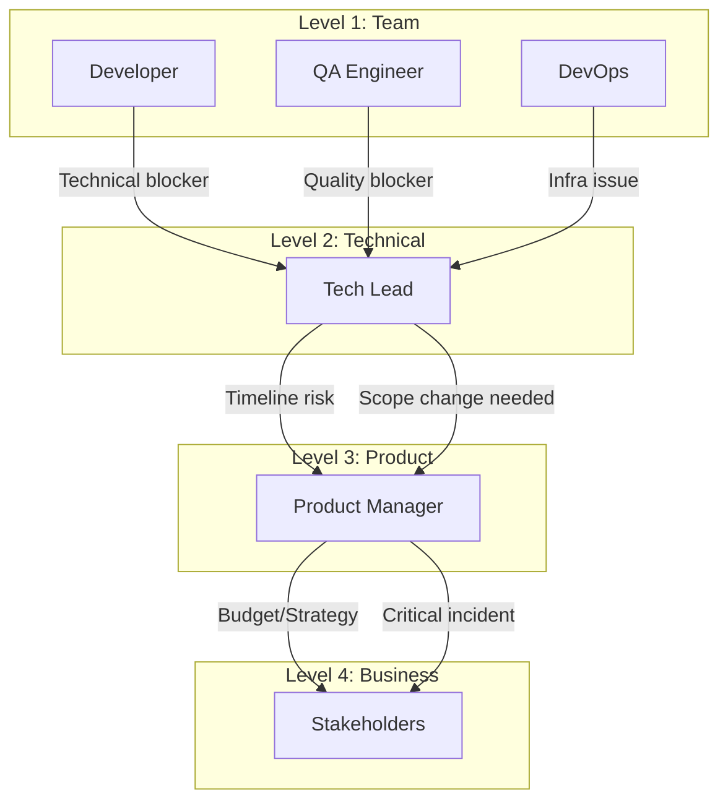
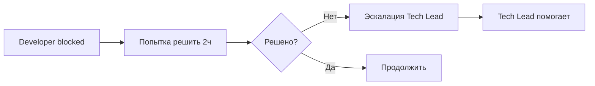
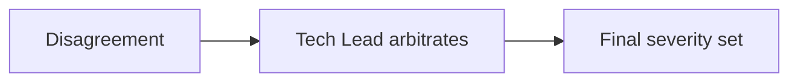
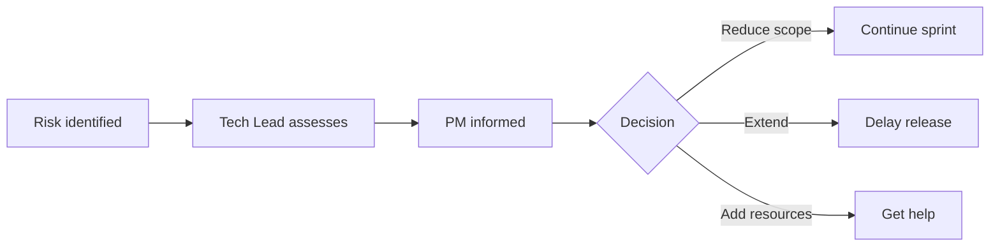
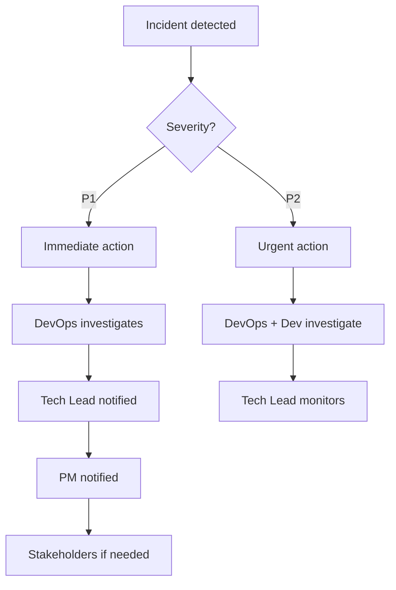
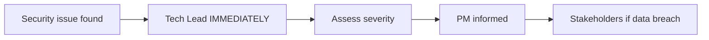
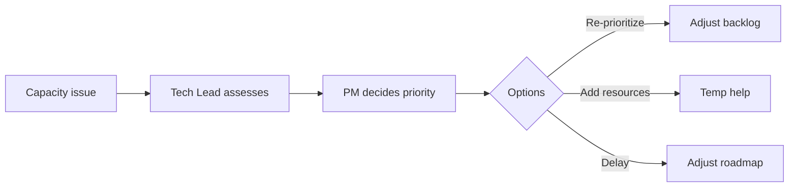
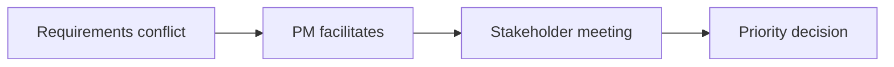

# Escalation Paths — Пути эскалации

> **Навигация**: [README](../README.md) | [Team Structure](../team-structure.md) | [TEAM-MASTER-REFERENCE](../TEAM-MASTER-REFERENCE.md)

## Обзор

Этот документ определяет когда, как и кому эскалировать проблемы в проекте Admin Logistic Panel v8.

## Уровни Severity

| Уровень | Название | Описание | Время реакции |
|---------|----------|----------|---------------|
| 🔴 P1 | Critical | Production down, data loss, security breach | < 30 мин |
| 🟠 P2 | High | Major functionality broken, блокер для команды | < 2 часа |
| 🟡 P3 | Medium | Feature degraded, workaround exists | < 24 часа |
| 🟢 P4 | Low | Minor issue, cosmetic, nice-to-have | Next sprint |

## Escalation Matrix



## Сценарии эскалации

### 1. Technical Blocker

**Описание:** Developer столкнулся с технической проблемой, которую не может решить.



**Template:**
```markdown
🔴 **Escalation: Technical Blocker**

**From**: @developer
**To**: @tech-lead
**Severity**: P2
**Task**: BE-201

**Problem**:
Не могу реализовать real-time updates — Supabase Realtime не работает с нашей конфигурацией.

**What I've Tried**:
1. Checked Supabase docs
2. Tried different channel configuration
3. Tested with simple subscription

**Impact**:
- BE-201 blocked
- Affects STORY-123 delivery date

**Need**:
Technical guidance or decision on alternative approach.
```

### 2. Bug Severity Dispute

**Описание:** QA и Developer не согласны с severity бага.



**Template:**
```markdown
⚠️ **Escalation: Severity Dispute**

**Bug**: BUG-789
**QA Assessment**: P1 (Critical)
**Dev Assessment**: P3 (Medium)

**QA Reasoning**:
Users cannot complete orders — core functionality broken.

**Dev Reasoning**:
Only affects 5% of orders with specific configuration.

**Request**:
@tech-lead — need final severity assessment.
```

### 3. Timeline Risk

**Описание:** Story/Sprint под угрозой срыва срока.



**Template:**
```markdown
🟠 **Escalation: Timeline Risk**

**From**: @tech-lead
**To**: @pm
**Severity**: P2

**Sprint**: Sprint 15
**Risk**: STORY-123 will not complete on time

**Reason**:
- External API integration taking longer than estimated
- Found additional edge cases
- 3 more story points needed

**Options**:
1. **Reduce scope**: Remove real-time updates (AC2) — deliver in next sprint
2. **Extend**: 2 additional days for completion
3. **Add help**: Another developer for 2 days

**Recommendation**:
Option 1 — real-time not critical for MVP

**Decision needed by**: EOD today
```

### 4. Production Incident

**Описание:** Проблема в production среде.



**P1 Incident Template:**
```markdown
🚨 **P1 INCIDENT: Production Down**

**Time**: 2024-01-15 14:30 UTC
**Status**: INVESTIGATING

**Symptoms**:
- API returning 500 errors
- Users cannot login
- Dashboard not loading

**Impact**:
- All users affected
- Core functionality unavailable

**Current Actions**:
1. @devops checking server logs
2. @tech-lead reviewing recent deployments
3. Considering rollback

**Communication**:
- @pm notified
- Status page updated

**Next Update**: 15 minutes

---
**Updates**:
- 14:35: Database connection exhausted identified
- 14:40: Restarting database connections
- 14:45: ✅ RESOLVED - services restored
```

### 5. Security Issue

**Описание:** Обнаружена уязвимость безопасности.



**Template:**
```markdown
🔴 **SECURITY ESCALATION**

**Severity**: P1
**Type**: [Vulnerability/Breach/Exposure]
**Discovered by**: @developer
**Time**: 2024-01-15 10:00 UTC

**Issue**:
[Description without sensitive details]

**Potential Impact**:
- Data exposure: Yes/No
- User data affected: Yes/No
- Financial impact: Yes/No

**Immediate Actions Taken**:
1. [What was done to contain]

**Recommended Actions**:
1. [Next steps]

**Confidentiality**:
⚠️ Do not discuss in public channels.

@tech-lead @pm — urgent attention needed
```

### 6. Resource/Capacity Issue

**Описание:** Недостаточно ресурсов для выполнения работы.



**Template:**
```markdown
🟡 **Escalation: Capacity Issue**

**From**: @tech-lead
**To**: @pm

**Situation**:
Sprint 15 has 50 SP committed, team capacity is 40 SP.

**Cause**:
- Unplanned bug fixing: 10 SP
- Developer sick: -5 SP capacity

**Options**:
1. Move STORY-124 to next sprint
2. Get temporary help
3. Accept overtime (not recommended)

**Recommendation**: Option 1

**Need decision by**: Sprint Planning
```

### 7. Stakeholder/Requirements Conflict

**Описание:** Конфликтующие требования от разных stakeholders.



**Template:**
```markdown
🟡 **Escalation: Requirements Conflict**

**From**: @pm
**To**: Stakeholders

**Conflict**:
- Stakeholder A wants feature X by Feb 1
- Stakeholder B wants feature Y by Feb 1
- Only capacity for one

**Feature X**:
- Value: [description]
- Effort: 20 SP

**Feature Y**:
- Value: [description]  
- Effort: 25 SP

**Recommendation**: Feature X (higher ROI)

**Request**:
Meeting to align priorities.
```

## Escalation Process

### Step-by-Step

```markdown
## Escalation Steps

1. **Identify** — Определить, что проблема требует эскалации
2. **Document** — Заполнить шаблон эскалации
3. **Notify** — Уведомить следующий уровень
4. **Track** — Отслеживать в Jira/ticket
5. **Update** — Регулярные обновления до разрешения
6. **Resolve** — Документировать решение
7. **Review** — Retrospective если P1/P2
```

### Escalation Response SLAs

| Severity | First Response | Update Frequency | Resolution Target |
|----------|---------------|------------------|-------------------|
| P1 | 30 min | Every 15 min | 4 hours |
| P2 | 2 hours | Every 2 hours | 24 hours |
| P3 | 24 hours | Daily | 1 week |
| P4 | 48 hours | Weekly | Next sprint |

## Post-Incident Process

### For P1/P2 Incidents

```markdown
## Post-Incident Review Template

### Incident Summary
- **Date/Time**: 
- **Duration**: 
- **Severity**: 
- **Impact**: 

### Timeline
- HH:MM — Incident detected
- HH:MM — Investigation started
- HH:MM — Root cause identified
- HH:MM — Fix implemented
- HH:MM — Incident resolved

### Root Cause
[Description of what caused the incident]

### Resolution
[How it was fixed]

### Prevention
- [ ] Action 1: [owner] [deadline]
- [ ] Action 2: [owner] [deadline]

### Lessons Learned
1. What went well
2. What could improve
3. Process changes needed
```

## Anti-Patterns

### ❌ Не эскалировать

- Вопросы, которые можно решить самостоятельно за 30 мин
- Личные конфликты (HR issue, не technical)
- Проблемы без попытки решить сначала

### ❌ Эскалация без информации

- "Что-то сломалось" — нужны детали
- "Не работает" — нужны steps to reproduce
- Эскалация без attempted solutions

### ❌ Пропуск уровней

- Developer → Stakeholders (мимо Tech Lead и PM)
- QA → PM без Tech Lead

---

**См. также:**
- [Task Lifecycle](./task-lifecycle.md)
- [Communication Protocols](./communication-protocols.md)
- [Handoff Procedures](./handoff-procedures.md)

