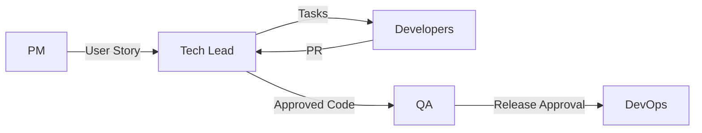

# Handoff Procedures — Процедуры передачи работы

> **Навигация**: [README](../README.md) | [Team Structure](../team-structure.md) | [TEAM-MASTER-REFERENCE](../TEAM-MASTER-REFERENCE.md)

## Обзор

Этот документ описывает как работа передается между членами команды, обеспечивая плавный переход и сохранение контекста.

## Основные точки передачи



## 1. PM → Tech Lead: User Story Handoff

### Триггер
User Story готова к разработке (Definition of Ready выполнен)

### Checklist передачи

```markdown
## Story Handoff Checklist

### Story Quality
- [ ] Title clear and descriptive
- [ ] User story format correct
- [ ] Acceptance Criteria complete
- [ ] Priority set
- [ ] Sprint assigned (если планируем)

### Supporting Materials
- [ ] Mockups attached (если нужны)
- [ ] API requirements described
- [ ] Data requirements clear
- [ ] Edge cases documented

### Context
- [ ] Business context explained
- [ ] Success metrics defined
- [ ] Dependencies noted
- [ ] Related stories linked
```

### Пример передачи

**PM действия:**
```markdown
1. Создать Story в Jira со всеми полями
2. Добавить в #admin-logistic-dev:
   
   📋 **New Story Ready**: STORY-123 Order Tracking
   
   **Link**: [Jira link]
   **Priority**: High
   **Sprint Target**: Sprint 15
   
   **Summary**: 
   Real-time tracking for delivery orders.
   
   **AC Count**: 5
   **Mockup**: Attached in ticket
   
   @tech-lead — ready for technical review
```

**Tech Lead действия:**
```markdown
1. Review Story в Jira
2. Добавить вопросы в comments (если есть)
3. После уточнений — подтвердить готовность:
   
   ✅ Story STORY-123 reviewed and ready for sprint planning
   
   - Technical feasibility: OK
   - Estimated complexity: Medium (5-8 SP)
   - Dependencies: None
   - Questions: Resolved
```

---

## 2. Tech Lead → Developer: Task Handoff

### Триггер
Sprint Planning завершен, задачи распределены

### Checklist передачи

```markdown
## Task Handoff Checklist

### Task Definition
- [ ] Task title specific
- [ ] Description clear
- [ ] Acceptance criteria from Story
- [ ] Story points assigned
- [ ] Assignee set

### Technical Guidance
- [ ] Architecture approach noted
- [ ] Affected modules listed
- [ ] API contract defined (если API)
- [ ] Database changes noted (если есть)

### Context
- [ ] Parent Story linked
- [ ] Related tasks linked
- [ ] Dependencies noted
- [ ] Blocking/blocked by clear
```

### Пример передачи

**Tech Lead действия:**
```markdown
## Task Creation: BE-201 Order Tracking Module

**Parent Story**: STORY-123
**Assignee**: @backend-dev
**Story Points**: 3

### Description
Create NestJS module for order tracking functionality.

### Technical Approach
- Create `tracking` module in `src/tracking/`
- Use existing Order model, add TrackingEvent model
- Implement event sourcing pattern for status history

### Files to Create/Modify
- `src/tracking/tracking.module.ts` (new)
- `src/tracking/tracking.controller.ts` (new)
- `src/tracking/tracking.service.ts` (new)
- `prisma/schema.prisma` (modify - add TrackingEvent)

### API Endpoints
- GET /api/v1/orders/:id/tracking
- POST /api/v1/orders/:id/tracking/events

### Acceptance Criteria
- [ ] TrackingEvent model created with migration
- [ ] GET endpoint returns tracking history
- [ ] POST endpoint creates new tracking event
- [ ] Unit tests for service (>80% coverage)

### Questions?
DM me or comment here.
```

**Developer действия:**
```markdown
1. Review task в Jira
2. Задать вопросы (если есть)
3. Перевести в "In Progress" когда начинаю
4. Уведомить если blocked:
   
   🔴 **Blocked**: BE-201
   
   **Reason**: Need API contract for courier integration
   **Blocked by**: Waiting for external API docs
   **Impact**: Cannot implement POST endpoint
   
   @tech-lead — need help resolving
```

---

## 3. Developer → Tech Lead: Code Review Handoff

### Триггер
Pull Request создан и готов к review

### Checklist передачи

```markdown
## PR Handoff Checklist

### PR Quality
- [ ] Branch follows naming convention
- [ ] Commits follow conventional commits
- [ ] PR title descriptive
- [ ] Description complete

### Code Completeness
- [ ] All AC implemented
- [ ] Tests added
- [ ] No linting errors
- [ ] Self-reviewed

### Documentation
- [ ] API documented (Swagger)
- [ ] Complex logic commented
- [ ] README updated (если нужно)
```

### PR Template

```markdown
## Description
[Что сделано в этом PR]

## Related Issues
- Closes BE-201
- Related to STORY-123

## Type of Change
- [ ] Bug fix
- [x] New feature
- [ ] Refactoring
- [ ] Documentation

## Changes Made
- Added TrackingEvent model
- Created tracking module with controller/service
- Added GET/POST endpoints for tracking

## Testing
- [ ] Unit tests added (tracking.service.spec.ts)
- [ ] E2E tests added (если нужно)
- [ ] Manual testing done locally

## Screenshots (если UI)
N/A - backend only

## Checklist
- [x] Code follows style guidelines
- [x] Self-reviewed
- [x] Tests pass locally
- [x] No new warnings
- [x] Documentation updated

## Notes for Reviewer
- Focus on the event sourcing pattern implementation
- TrackingEvent model might need optimization for queries
```

### Notification

```markdown
👀 **PR Ready for Review**: BE-201 Order Tracking Module

**PR**: [GitHub link]
**Task**: [Jira link]
**Size**: Medium (~300 lines)

**Summary**: 
Implements tracking module with event sourcing for order status history.

**Review Focus**:
- Event sourcing pattern correctness
- Query optimization for tracking history

@tech-lead — ready for review
```

---

## 4. Tech Lead → QA: Testing Handoff

### Триггер
PR merged и deployed to staging

### Checklist передачи

```markdown
## Testing Handoff Checklist

### Deployment
- [ ] Code merged to develop/main
- [ ] Deployed to staging
- [ ] Database migrations applied
- [ ] No deployment errors

### Test Information
- [ ] Story linked
- [ ] AC listed
- [ ] Test data prepared
- [ ] Known limitations noted

### Environment
- [ ] Staging URL confirmed
- [ ] Test credentials provided
- [ ] API documentation updated
```

### Notification

```markdown
✅ **Ready for Testing**: STORY-123 Order Tracking

**Staging**: https://staging.admin-logistic.com
**Story**: [Jira link]
**Deployed**: 2024-01-15 14:00 UTC

### What's New
- Order tracking page with status history
- Real-time status updates
- Courier information display

### Test Credentials
- Login: test-dispatcher@example.com
- Password: [secure channel]

### Test Data
- Orders with tracking: ORD-001, ORD-002, ORD-003
- Order without tracking: ORD-004

### Known Limitations
- Real-time updates have 30s delay (as per AC)

### Acceptance Criteria
1. AC1: Status display — test with ORD-001
2. AC2: Real-time updates — change status via API
3. AC3: Courier info — test with ORD-002

@qa — ready for testing
```

---

## 5. QA → DevOps: Release Handoff

### Триггер
Все stories в спринте протестированы и approved

### Checklist передачи

```markdown
## Release Handoff Checklist

### Testing Complete
- [ ] All stories QA approved
- [ ] No P1/P2 open bugs
- [ ] Regression passed
- [ ] Performance acceptable

### Release Artifacts
- [ ] Release notes prepared
- [ ] Version number confirmed
- [ ] Changelog updated

### Sign-off
- [ ] QA sign-off given
- [ ] Tech Lead approval
- [ ] PM notified
```

### Release Approval

```markdown
🚀 **Release Approved**: v1.2.0

**Stories Included**:
- STORY-123: Order Tracking ✅
- STORY-124: Dashboard Updates ✅
- FIX-456: Status Badge Color ✅

**Testing Summary**:
- Functional: 45/45 passed
- Regression: 120/120 passed
- API: 100% passed
- Performance: Within limits

**Known Issues**:
- None blocking release

**Sign-off**:
- QA: @qa-engineer ✅
- Tech Lead: @tech-lead ✅

@devops — approved for production deployment
```

---

## 6. DevOps → Team: Deployment Handoff

### Триггер
Deployment завершен

### Notification

```markdown
🎉 **Deployed to Production**: v1.2.0

**Time**: 2024-01-15 16:00 UTC
**Duration**: 5 minutes
**Downtime**: None

**Changes**:
- STORY-123: Order Tracking
- STORY-124: Dashboard Updates
- FIX-456: Status Badge Color

**Status**:
- Backend: ✅ Healthy
- Frontend: ✅ Healthy
- Database: ✅ Migrations applied
- Smoke Test: ✅ Passed

**Monitoring**:
- Errors: [Sentry link]
- Metrics: [Dashboard link]

**Rollback Plan**:
Ready if needed — notify @devops immediately if issues found.

@team — deployment complete!
```

---

## Handoff Best Practices

### Do's ✅

1. **Complete checklists** — Don't skip items
2. **Provide context** — Next person should understand "why"
3. **Link everything** — Stories, PRs, documentation
4. **Notify explicitly** — Don't assume people check Jira
5. **Document blockers** — If handoff delayed, explain why

### Don'ts ❌

1. **Don't throw over the wall** — Ensure receipt confirmation
2. **Don't assume knowledge** — Include necessary context
3. **Don't skip QA** — Every change needs testing
4. **Don't rush handoffs** — Incomplete handoff = rework later

### Handling Incomplete Handoffs

```markdown
## Incomplete Handoff Protocol

1. Receiver identifies missing information
2. Notify sender immediately with specific questions
3. Sender provides missing information within SLA
4. If sender unavailable, escalate to Tech Lead
5. Document what was missing for process improvement
```

---

**См. также:**
- [Task Lifecycle](./task-lifecycle.md)
- [Communication Protocols](./communication-protocols.md)
- [Escalation Paths](./escalation-paths.md)

