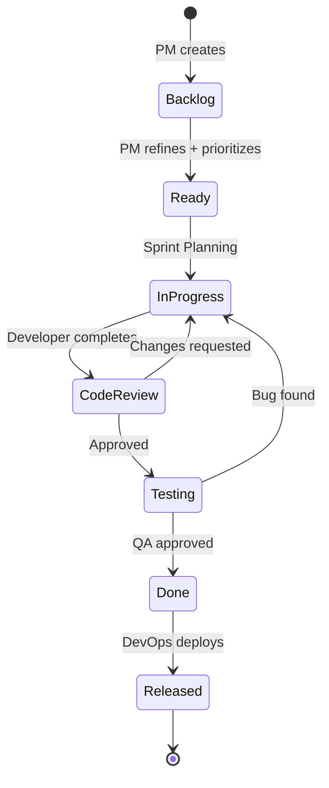
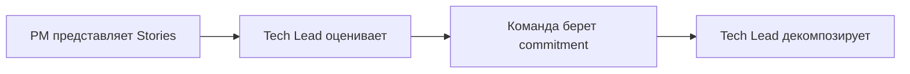
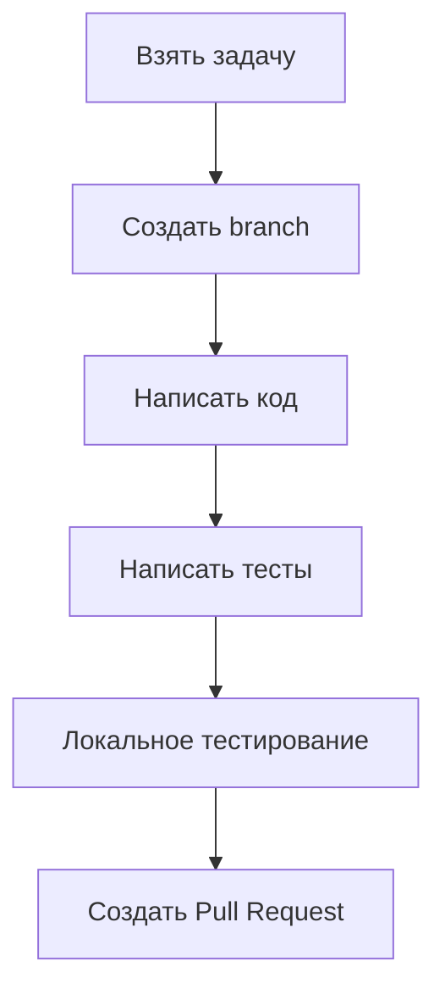
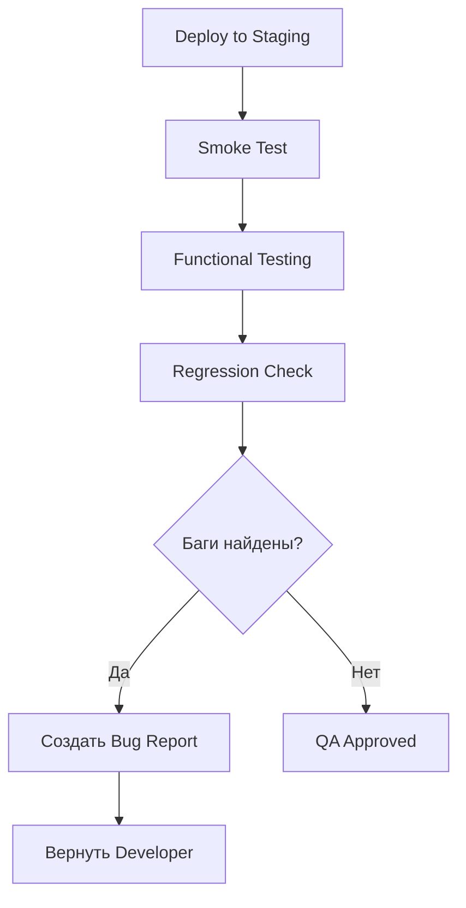
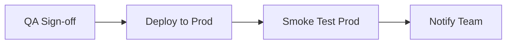
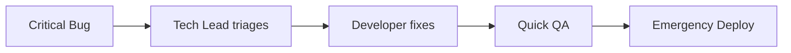

# Task Lifecycle — Жизненный цикл задачи

> **Навигация**: [README](../README.md) | [Team Structure](../team-structure.md) | [TEAM-MASTER-REFERENCE](../TEAM-MASTER-REFERENCE.md)

## Обзор

Этот документ описывает полный путь задачи от идеи до production в проекте Admin Logistic Panel v8.

## Визуализация жизненного цикла



## Этапы жизненного цикла

### 1. Backlog (Бэклог)

| Параметр | Значение |
|----------|----------|
| **Владелец** | Product Manager |
| **Входной критерий** | Идея от stakeholder или команды |
| **Выходной критерий** | User Story создана |

**Действия PM:**
```markdown
1. Создать User Story в Jira/Linear
2. Формат: "As a [role], I want [feature], so that [benefit]"
3. Добавить базовое описание
4. Установить Epic (если есть)
```

**Пример:**
```
Title: Track order delivery status

As a customer service representative
I want to see real-time delivery status
So that I can inform customers about their orders

Description:
- Show current status (Pending, In Transit, Delivered)
- Show estimated delivery time
- Show courier information
```

---

### 2. Ready (Готова к работе)

| Параметр | Значение |
|----------|----------|
| **Владелец** | Product Manager + Tech Lead |
| **Входной критерий** | User Story в Backlog |
| **Выходной критерий** | Definition of Ready выполнен |

**Definition of Ready Checklist:**
- [ ] Acceptance Criteria написаны
- [ ] Story оценена (story points)
- [ ] Зависимости определены
- [ ] Mockups/wireframes приложены (если нужно)
- [ ] Технические вопросы разрешены

**Grooming Session:**
```
Участники: PM, Tech Lead, Developers (опционально QA)
Длительность: 30-60 минут
Результат: Stories готовы для Sprint Planning
```

**Пример Acceptance Criteria:**
```markdown
## Acceptance Criteria

### AC1: Status Display
Given I am viewing an order
When the order has status "In Transit"
Then I see:
- Status badge "In Transit" (yellow)
- Estimated delivery date/time
- Last known location

### AC2: Status Updates
Given I am viewing an order
When the status changes
Then the page updates within 30 seconds
Without manual refresh

### AC3: Courier Info
Given the order is "In Transit"
When I view order details
Then I see courier name and phone (masked)
```

---

### 3. Sprint Planning

| Параметр | Значение |
|----------|----------|
| **Владелец** | Tech Lead |
| **Входной критерий** | Stories в статусе Ready |
| **Выходной критерий** | Sprint backlog сформирован |

**Процесс:**


**Декомпозиция Tech Lead:**
```markdown
## Story: Track order delivery status (8 SP)

### Backend Tasks (Backend Developer)
- [BE-201] Create OrderTracking module (2 SP)
- [BE-202] Add tracking API endpoints (2 SP)
- [BE-203] Integrate with courier API (3 SP)

### Frontend Tasks (Frontend Developer)
- [FE-201] OrderStatus component (2 SP)
- [FE-202] Real-time status updates (2 SP)
- [FE-203] Courier info display (1 SP)

### QA Tasks
- [QA-201] Test cases for tracking flow
```

---

### 4. In Progress (В работе)

| Параметр | Значение |
|----------|----------|
| **Владелец** | Developer (Backend/Frontend) |
| **Входной критерий** | Task взят в Sprint |
| **Выходной критерий** | Код написан, тесты пройдены |

**Workflow разработчика:**



**Branch naming:**
```
feature/BE-201-order-tracking-module
fix/FE-202-status-update-bug
```

**Commit messages (Conventional Commits):**
```
feat(orders): add tracking status endpoint
fix(ui): correct status badge color
test(orders): add tracking service tests
docs(api): update tracking endpoint docs
```

**Pull Request Template:**
```markdown
## Description
Implements order tracking module with status updates.

## Related Issues
- Closes BE-201
- Related to STORY-123

## Changes
- Added OrderTrackingController
- Added OrderTrackingService
- Added Prisma model for tracking events

## Checklist
- [ ] Tests added/updated
- [ ] Documentation updated
- [ ] No console errors
- [ ] Self-reviewed code
```

---

### 5. Code Review

| Параметр | Значение |
|----------|----------|
| **Владелец** | Tech Lead |
| **Входной критерий** | PR создан |
| **Выходной критерий** | PR approved и merged |

**Review Checklist Tech Lead:**
```markdown
## Code Review Checklist

### Code Quality
- [ ] Follows project conventions
- [ ] No unnecessary complexity
- [ ] Proper error handling
- [ ] No `any` types (TypeScript)

### Architecture
- [ ] Correct module structure
- [ ] Proper dependency injection
- [ ] No circular dependencies

### Testing
- [ ] Unit tests present
- [ ] Edge cases covered
- [ ] Tests are meaningful

### Security
- [ ] No exposed secrets
- [ ] Input validation
- [ ] Proper authorization checks

### Documentation
- [ ] API documented (Swagger)
- [ ] Complex logic commented
```

**Review outcomes:**
- ✅ **Approved** → Merge и переход в Testing
- 🔄 **Changes Requested** → Возврат в In Progress
- ❓ **Questions** → Discussion needed

---

### 6. Testing (QA)

| Параметр | Значение |
|----------|----------|
| **Владелец** | QA Engineer |
| **Входной критерий** | PR merged, deployed to staging |
| **Выходной критерий** | Все AC проверены, нет blockers |

**QA Workflow:**



**Testing Scope:**
```markdown
## QA Testing: Order Tracking (STORY-123)

### Functional Tests (по AC)
- [ ] AC1: Status display correct
- [ ] AC2: Real-time updates work
- [ ] AC3: Courier info shown

### Edge Cases
- [ ] Order without tracking
- [ ] Multiple status changes
- [ ] Network interruption

### Integration
- [ ] Works with existing orders
- [ ] No regression on order list

### Cross-browser
- [ ] Chrome
- [ ] Firefox
- [ ] Safari (if required)
```

---

### 7. Done (Готово)

| Параметр | Значение |
|----------|----------|
| **Владелец** | Tech Lead |
| **Входной критерий** | QA approved |
| **Выходной критерий** | Ready for release |

**Definition of Done:**
```markdown
## Definition of Done

- [ ] All Acceptance Criteria met
- [ ] Code reviewed and merged
- [ ] Tests passing (unit, integration)
- [ ] QA testing passed
- [ ] No P1/P2 bugs open
- [ ] Documentation updated
- [ ] Ready for production deployment
```

---

### 8. Released (Выпущено)

| Параметр | Значение |
|----------|----------|
| **Владелец** | DevOps Engineer |
| **Входной критерий** | Stories в Done, QA sign-off |
| **Выходной критерий** | В production |

**Release Process:**


**Release Checklist:**
```markdown
## Release Checklist

### Pre-deployment
- [ ] All stories Done
- [ ] QA sign-off received
- [ ] No blocking bugs
- [ ] Database migrations ready

### Deployment
- [ ] Run migrations
- [ ] Deploy backend
- [ ] Deploy frontend
- [ ] Verify health checks

### Post-deployment
- [ ] Smoke test production
- [ ] Monitor error rates
- [ ] Announce to team
- [ ] Update release notes
```

---

## Timing Guidelines

| Этап | Типичное время |
|------|---------------|
| Backlog → Ready | 1-3 дня |
| Ready → Sprint | До начала спринта |
| In Progress | 1-5 дней (зависит от SP) |
| Code Review | < 24 часов |
| Testing | 1-2 дня |
| Done → Released | До конца спринта |

## Exception Handling

### Hotfix Flow



**Hotfix criteria:**
- Production down
- Data corruption risk
- Security vulnerability
- Revenue impact

### Blocked Tasks

```markdown
## Blocked Task Protocol

1. Developer marks task as "Blocked"
2. Add blocker description in comment
3. Notify Tech Lead immediately
4. Tech Lead resolves or escalates
5. Блокер разрешен → продолжить работу
```

---

**См. также:**
- [Communication Protocols](./communication-protocols.md)
- [Handoff Procedures](./handoff-procedures.md)
- [Escalation Paths](./escalation-paths.md)

